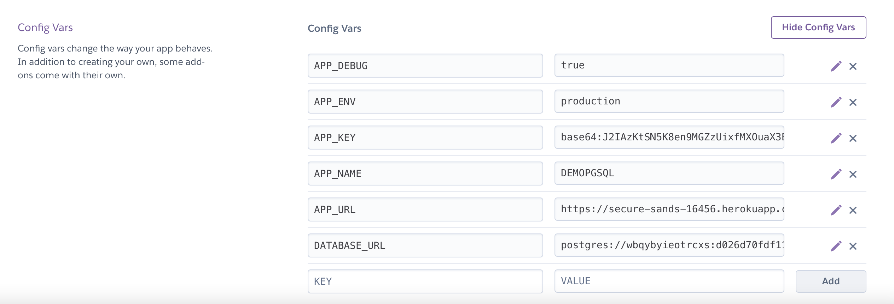

# Tasques comunes en desplegament d'aplicacions PHP

## Introducció

Totes les aplicacions són diferents, així com el seu procés de desplegament. Els passos més habituals per al desplegament de PHP solen ser els següents:

* Aplicació  de proves
* Baixada de dependències \(Composer\)
* Compilar recursos \(Gulp / Webpack / Grunt\)
* Desplegament al servidor

Per descomptat, hi pot haver més passos. Per exemple, és possible que vulguem migrar les bases de dades o reiniciar el servidor mitjançant SSH; tot depèn de les especificacions del projecte i del maquinari.

Abans de continuar, hi ha dues coses que cal destacar cada vegada que entra en joc la paraula "**desplegament**":

**I. Mantingueu-ho tot en control de versions \(git\)**

Codi  de l'aplicació, fitxers de configuració, documentació, scripts de migració de db: tots ells s'han de mantenir segurs i sans al repositori. Per descomptat, a totes les regles hi ha excepcions \(sobretot en informàtica\), que ens porten a la segona regla:

**II. No emmagatzemeu mai al repositori dependències ni aplicacions compilades.**

Si guardem dependències i aplicacions compilades al repositori tard o d’hora es produirà un greu embús al  projecte, i això passarà més aviat que tard.

### Tipus de desplegament


### **Desplegueu reposicions sense artefactes i dependències i creeu la vostra aplicació al servidor**

\*\*\*\*

1. En primer lloc, hem de crear i provar l’aplicació. Ho podem fer localment, en un servidor de compilació \(per exemple, Jenkins\) o en núvol \(Buddy\).
2. Un cop superades les proves, podem carregar el codi font al servidor \(en aquest cas sense dependències ni artefactes\) mitjançant FTP, SFTP o Rsync.
3. L'últim pas és descarregar les dependències i crear l'aplicació al servidor. La forma més senzilla és executar un script al servidor mitjançant SSH.

### **Desplegueu repo amb dependències i artefactes**

En aquest flux de treball, l’aplicació es compila i prova primer, i després es desplega al servidor en la seva forma final \(amb dependències i artefactes\):

### **La variació de Git**

Això és bàsicament el mateix que el número 1, però requereix Git instal·lat al servidor de producció. El desplegament es fa amb la **càrrega**  de fitxers`git push` en lloc de la normal. A continuació, a Git, el ganxo posterior a la recepció activa la compilació. Mireu [article](https://coderwall.com/p/xczkaq/ftp-is-so-90-s-let-s-deploy-via-git-instead)

###  **Temps d'inactivitat zero / desplegament atòmic**

Els fluxos de treball anteriors tenen un defecte: el temps d'inactivitat. Això significa que la vostra aplicació no estarà disponible per al client durant el desplegament. La solució a això és molt senzilla: **desplegueu i creeu l'aplicació en una carpeta diferent a la de la qual s'ha servit** .  


El procés consisteix a crear un parell de directoris al servidor:

* `/current`
  * un enllaç simbòlic a la versió actual del directori de versions al qual apunta el vostre servidor web.
* `/releases`
  * conté l'historial de fitxers penjats. Per a cada versió es crea un directori amb el nom de l'etiqueta de revisió.
* `/deploy-cache`
  * s’utilitza per emmagatzemar fitxers nous durant el desplegament. Un cop finalitzada la càrrega, el seu contingut es copia a un directori nou del `/releases`directori.

Així és com funciona:

1. Es carrega una nova versió de l'aplicació a `deploy-cache`
2. Es `deploy-cache`copia el contingut de`/releases/${revision}`
3. L'enllaç simbòlic actual es canvia a `/releases/${revision}`

### **Desplegament de Docker**

```text
FROM php:7
RUN apt-get update -y && apt-get install -y openssl zip unzip git
RUN curl -sS https://getcomposer.org/installer | php -- --install-dir=/usr/local/bin --filename=composer
RUN docker-php-ext-install pdo mbstring
WORKDIR /app
COPY . /app
RUN composer install

CMD php artisan serve --host=0.0.0.0 --port=8181
EXPOSE 8181
```

Aquí teniu un exemple de fitxer Docker per a una aplicació PHP:

Docker és un mètode de virtualització que us permet definir l’entorn de treball de la vostra aplicació en un únic fitxer de text \(Dockerfile\), juntament amb la forma en què s’hauria de construir. El fitxer s'utilitza per crear una imatge de Docker amb la vostra aplicació que es pot iniciar en qualsevol entorn compatible amb Docker \(Linux / Mac OS / Windows\). Docker és molt ràpid i lleuger, contràriament als mètodes de virtualització "tradicionals".


El fitxer es pot utilitzar per crear una imatge de Docker:

```text
$ docker build -t my-image .
```

Un cop creada la imatge, podeu iniciar l'aplicació en un contenidor Docker aïllat del seu amfitrió

```text
$ docker run -p 8081:8081 my-image
```

A més, les imatges de Docker es poden extreure i extreure d'un registre de Docker. D'aquesta manera, podeu crear i crear imatges fàcilment en un servidor / PC i executar-les en un altre. En aquest cas, tot el procés de lliurament serà el següent:

1. Sol·licitud de prova
2. Construeix la imatge Docker amb l'aplicació
3. Introduïu l'aplicació al registre Docker
4. SSH al servidor de producció a. Docker pull b. Docker run

## Desplegament d'aplicació Laravel sobre Heroku

Sobretot caldrà revisar la documentació, atès que aquesta va variant en funció de les [versions](https://devcenter.heroku.com/articles/getting-started-with-laravel) disponibles .

A continuació repasem quins serien:

### 1. Creació de projecte laravel

`composer create-project laravel/laravel projecte`

### 2. Inicialitzar git

Dins de la carpeta de projecte:

**`git init`**

### 3. Crear Procfile

Per modificar el DocumentRoot de l'aplicació Laravel i deixar-lo en la carpeta public/, en la carpeta de projecte

```text
echo "web: vendor/bin/heroku-php-apache2 public/" > Procfile
```

  
I pugem els canvis al nostre repositori local.

```text
git add .
git commit -m "Procfile de heroku"
```

### 4. Crear la nova aplicació en Heroku

Si estem loguejats a heroku amb el nostre compte, podem utilitzar el comando **`heroku create`** des de la carpeta de projecte, això genera un canal push per al projecte local amb el projecte remot en Heroku.

Ja podem fer servir el comando git push per actualitzar el projecte a Heroku, des de  la carpeta de projecte:

```bash
git push heroku master
```


### 5. Variables d'entorn de l'aplicació a Heroku

Es tracta de definir les variables .env de l'aplicació Laravel a Heroku. Tenim dues vies d'entrada, a través de **Heroku cli**, 

```bash
heroku config:set APP_KEY=$(php artisan key:generate --show)
```

També podem accedir al [Dashboard](https://dashboard.heroku.com/apps) de l'aplicació a heroku.com i seleccioneu l'aplicació, i en _Settings_, accedim a _Config Vars._ Ara podem afegir les variables d'entorn en producció.




