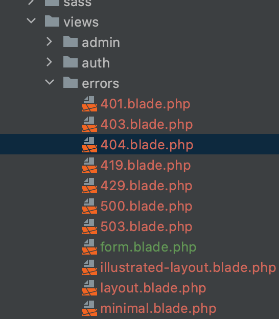

# Tricks Laravel

## Blade

### Nom usuari autenticat en Blade

```php
{{Auth::user()->name}}
{{Auth::user()->//metodes de model User
```


### Definir una secció autenticat en menú

```php
@auth
     <li class="nav-item">
        <a class="nav-link" href="{{route('users.index')}}">Users</a>
    </li>
    <li class="nav-item">
        <a class="nav-link" href="{{route('properties.index')}}">Properties</a>
    </li>
@endauth
                    
```

### Select form en formulari update amb opció preseleccionada

```php
<form action="{{route('profile.properties.update',['user'=>Auth::user(),'property'=>$property])}}" method="POST" enctype="multipart/form-data">
    @csrf
    @method('PUT')
    Description
    <br/>
    <textarea name="description"  class="form form-control" >{{$property->description}}</textarea>
    Price
    <br/>
    <input type="text" name="price" value="{{$property->price}}" class="form form-control">
    Type
    <br/>
    <select class="form-control" name="type" value="{{old($property->type)}}">
    @foreach($types as $type)
        <option value="{{ $type }}" @if(old('type',$property->type)==$property->type) 'selected' @endif  >{{$type}}</option>
    @endforeach
    </select>
    <br/>
    Photo:
    <input type="file" name="photo" class="form-control-file">
    <br/>
    <br/>
    @if($property->photo!=null)photo)}}" width="150px">@endif
    <br/>
    <br/>
    <input type="submit" class="btn btn-primary" value="Save">
    <br/>
    <br/>
</form>
```

### Blade, eliminar objecte a través de mètode DELETE

```php
<form action="{{route('videos.destroy',$video)}}" method="POST">
 <!--  <input name="_method" type="hidden" value="DELETE"> -->
      @csrf
      @method("DELETE")
      <button class="btn btn-danger">Remove</button>
</form>
```

### Paginació amb bootstrap

Modificar **AppServiceProvider** en Providers:

```php
 public function boot()
    {
        Paginator::useBootstrap();
    }
```

En el moment de treure la col·lecció, apliquem **`paginate(n)`** amb el número d'elements visualitzats per pàgina.


I en blade:

```php
{{-- Pagination --}}
<div class="d-flex justify-content-center">
    {!! $videos->links() !!}
</div>
```


### Personalitzar les vistes d'errors

Publicar les pàgines d'error internes de laravel a les vistes en resources, per modificar-les al nostre gust:

```php
 php artisan vendor:publish --tag=laravel-errors 
```



### Recòrrer una col·lecció amb dades buides

```php
 @forelse($videos as $video)
            <div class="col-lg-4 bg-dark">
                <div class="card m-2">
                    <div class="card-header">
                        {{$video->title}}
                    </div>
                    <div class="card-body">
                        <div style="overflow: hidden; width: 100%; height: 150px;">
                            <a href="{{route('videos.show',$video)}}">
                            <video autoplay loop muted>
                            <source src="{{asset('storage/'.$video->url)}}" type="video/mp4">
                        </video></a>
                        </div>
                    </div>
                    <div class="card-footer">
                        <cite>Valoració</cite>
                    </div>
                </div>
            </div>
    @empty
                No videos found yet
    @endforelse
```


