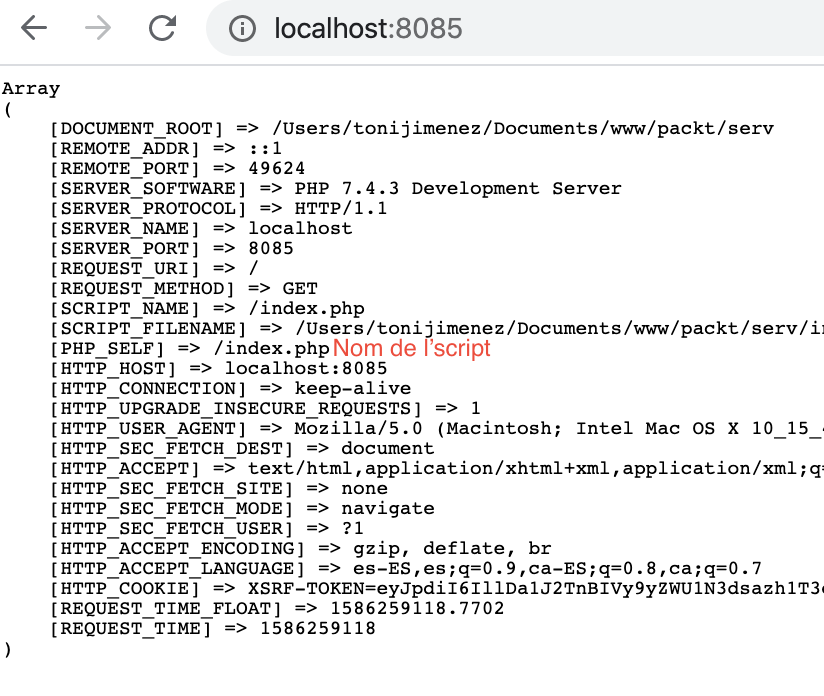

# UF1. Desenvolupamet web

### Introducció

La clau per **aprendre** és sempre anar pas a pas, entendre quines tecnologies impliquen el desenvolupament web.

El primer pas és precisament estudiar el llenguatge **html,** comprendre per exemple, Quina finalitat té el bloc etiqueta _**`<div>`**_**`.`** Aprendre a estructurar un document que servirà de base a la nostra aplicació. 

Un cop tenim l'**arquitectura html**, anem a deixar-lo bonic, per això tenim el CSS, i si volem que pugui interactuar am l'usuari, tenim el javascript , per tant HTML + CSS +JS, el que diem _**frontend**_ ****de l'aplicació. Més enllà d'això trobem el que hi ha al darrera, el _backend_, que proporciona lògica, funcionament i accés a dades.

### **PHP?**

PHP és l'acrònim de Hypertext Preprocessor. PHP és un llenguatge de script, es va construir específicament per a la web, les seves possibilitats són molt elevades.  
PHP es va crear com a llenguatge de script per permetre un contingut dinàmic ric \(el contingut pot provenir d'altres pàgines PHP o pot ser de naturalesa dinàmica i provenir de fonts externes com una base de dades\). PHP és un **llenguatge interpretat**, el que significa que no cal compilar-lo i crear un fitxer executable. En lloc d'això, els fitxers PHP són interpretats línia per línia pel servidor web que utilitza PHP.

PHP s'utilitza juntament amb **HTML**, **JavaScript** i **CSS** per crear aplicacions web dinàmiques. Com que PHP és fàcil d’aprendre, té una gran comunitat de desenvolupadors a tot el món. Això ha fet que cada vegada més desenvolupadors puguin publicar projectes, frameworks i recursos de codi obert. Per exemple, PHP Framework Interop Group, conegut també com [PHP-FIG](https://www.php-fig.org/) , ha creat una sèrie de recomanacions que la majoria dels desenvolupadors utilitzen per escriure el seu codi. GitHub acull molts projectes de codi obert per als altres, i llocs com [Youtube](http://youtube.com/) tenen molts vídeos sobre desenvolupament web.

### Com funciona?


PHP és un llenguatge script  de servidor. El script de costat del servidor és una manera de com els servidors web poden respondre a les sol·licituds del client mitjançant **HTTP**. 

El seu **funcionament** és que un client \(un navegador\) sol·licita una URL **REQUEST**. Una sol·licitud és enviada per un servidor web a un script. A continuació, l'script llegeix aquesta sol·licitud i, depenent del codi de l'script, retorna el contingut d'una pàgina **RESPONSE**.

Aquest procés es produeix cada vegada que es visita una pàgina web. Quan es treballa amb formularis, les dades s’envien des del client al servidor. Les dades es processen i es retorna una resposta. 

Un exemple habitual és que a Facebook, introduïu una actualització d'estat i premeu _Enter_ . El text s’envia a través d’una `POST`sol·licitud al servidor, comprovat per les seqüències del servidor i després es desa a una base de dades. La pàgina web s'actualitza amb la nova publicació. Els llocs PHP també poden ser serveis d’API, que es poden cridar des de scripts JavaScript \(com  AJAX, per exemple\) o des d’altres serveis. En aquests casos i similars, no hi ha cap sol·licitud de navegador implicada.

Per al desenvolupament de la web es necessiten les següents eines:

* Un navegador com Google Chrome, Firefox o Microsoft Edge.
* Un editor de text com Microsoft Visual Studio Code o un **entorn integrat de desenvolupament** \( **IDE** \), com ara PHPStorm.
* Es pot utilitzar un servidor per executar PHP Apache o NGINX, així com el servidor integrat de PHP.

### Motor de plantilles integrat

PHP es va crear exclussivament per escriure aplicacions web. Es pot escriure juntament amb HTML per crear pàgines **dinàmiques**. Veurem exemples d’això en un moment.

Un motor de plantilla de PHP és: una manera de permetre que el codi PHP pugui notrir  de contingut **HTML**. Això dóna flexibilitat a les pàgines. Qualsevol pàgina destinada a utilitzar el codi PHP té una extensió .**php** en lloc d’una extensió .**html**. Això informa al servidor web que espera el contingut de PHP.

#### **Important**:: 

Un fitxer PHP té una extensió .php i pot contenir HTML, JavaScript i CSS, juntament amb PHP. Com que l'intèrpret de PHP necessita saber on es col·loca el codi en un fitxer PHP, el codi PHP s'escriu entre dues etiquetes especials \( `<?php... ?>`\). Aquestes etiquetes s'anomenen etiquetes d'obertura i tancament. Un fitxer PHP típic s’assembla a aquest:

```php
<!DOCTYPE html>
<html lang="es">
<head>
    <meta charset="UTF-8">
    <meta name="viewport" content="width=device-width, initial-scale=1.0">
    <meta http-equiv="X-UA-Compatible" content="ie=edge">
    <title>PHP Page</title>
		
</head>
<body>
    <div>
        <h1>Titol</h1>
        <p>
	   <?php
		
          // codi php 
		
           ?>
	</p>        
    </div>
</body>
		
<script>
		
// codi JS
		
</script>
</html>
```

Us adjuntem una [sintaxi més acurada del PHP](../apendixs/sintaxi-php.md).

## Introducció al PHP


### Sortida  amb un script PHP

En aquest moment, hem après com utilitzar la `echo`instrucció. Continuem i creem el vostre primer script PHP. Imprimirem la mateixa declaració que abans, però utilitzarem un fitxer PHP aquesta vegada. Seguim aquests passos:

1. En una carpeta crearem un fitxer o script php.
2. Creeum un fitxer anomenat `hello.php`dins de la carpeta.
3. Obrim el `hello.php`fitxer mitjançant un editor de codi com VSCode o Sublime Text.
4. Escrivim el codi següent `hello.php`i guardem-lo:

   ```text
   <? php 
   eco "Hello World!"; 
   ?>
   ```

5. Ara, obrim el Terminal i anem a la carpeta. Feu servir `cd`el nom de la carpeta per anar a la carpeta. Per pujar una carpeta, utilitzeu `../`.
6. Executem l'ordre següent a l'indicador d'ordres:

   ```text
   php hola.php
   ```

   Veurem `Hello World!`imprès a la pantalla

### Assignació de variables

Igual que amb qualsevol altre llenguatge de programació, s’utilitzen variables a PHP per emmagatzemar dades. Tots els noms de variables en PHP han de començar amb el signe de dòlar, `$`.

Les variables han de començar per una lletra. No poden començar amb un número ni un símbol, però poden contenir números i símbols.

Les dades emmagatzemades en variables poden ser dels següents tipus:

* Nombres sencers 
* Booleà: cert o fals 
* Float: número de coma flotant
* Cadena: lletres i números

Aquí tenim un exemple:

```php
<?php
    $name = $argv[1];
    echo "Hello ". $name;
?>
```

I per executar-lo, argv\[1\] representa primer argument que es passa després del nom de l'script.

```php
$ php script.php Toni
Hello Toni
```

### Exercici : utilitzar el servidor integrat per imprimir una cadena

En aquest exercici, utilitzarem el servidor integrat per imprimir `Hello FruitCP`mitjançant la cadena de consulta`companyName=FruitCP`. Això  permetrà començar a utilitzar el navegador per visualitzar la sortida del codi, en comptes de fer servir el shell interactiu. Seguim aquests passos:

1. Torneu a obrir el `script.php`fitxer amb l’editor de codi IDE.
2. Substituim el codi pel següent codi i desem el fitxer:


```php
<?php
    $name = $_GET['companyName'];
    echo "Hello". $name;
?>
```

1. Al Terminal, entre, **dins** la carpeta
2. Executem la següent comanda per executar el servidor web integrat de PHP:

   ```text
   php -S localhost: 8085 
   ```

3. Ara, obrim el navegador i introduim el següent a la barra d’adreces i fem clic a _Enter_ :

   ```text
   http://localhost:8085/script.php?companyName=FruitCP
   ```

Observem l’URL al navegador. Després del nom del fitxer, hem afegit `?companyName=FruitCP`. `?`designa que el que segueix és una cadena de consulta o **Query**. Al nostre codi, s'està passant al fitxer PHP una variable anomenada `companyName`amb un valor de `FruitCP`.

A la primera línia del codi, tenim `$_GET['companyName']`. `$_GET`és també una variable predefinida que actúa quan s'executa qualsevol cadena PHP amb una cadena de consulta. Així doncs, amb l’ús `$_GET['companyName']`, obtindrem el valor `FruitCP`, que s’emmagatzemarà a la  variable`$name`. Recordem que podem extreure qualsevol valor de la cadena de consulta mitjançant la clau respectiva.

### Mostrar informació del servidor

Preparem el següent script:

```php
<?php
    echo '<pre>';
    print_r($_SERVER);
    echo '</pre>';
?>
```

Executem servidor integrar des de la carpeta de l'script, doneu el nom **index.php** a l'script, de forma automàtica els servidors busquen aquest nom per executar-lo.

**RECOMANACIÓ. UNA APLICACIÓ  EN UNA CARPETA**

```php
$ php -S localhost:8085
PHP 7.4.3 Development Server (http://localhost:8085) started
```

Comproveu la sortida:



### Isset per veure si una variable té valor

**`isset`** és una funció de PHP que retorna `true` per a variables declarades amb valor, si no, retorna `false`

```php
<?php

    $name1 = '';
    
    $name2 = null;
    
    echo 'checking $name1 : ';
    var_dump(isset($name1));
    
    echo '<br>';
    
    echo 'checking $name2: ';
    var_dump(isset($name2));
    
    echo '<br>';
    
    echo 'checking undeclared variable $name3: ';
    var_dump(isset($name3));
    
?>
```

Que retornaria com a resultat:

```php
checking $name1 : bool(true)
checking $name2: bool(false)
checking undeclared variable $name3: bool(false)
```


Analitza el resultat


Una funció relacionada amb aquesta és **`unset`**

## Tipus i operadors


A continuació es mostren els vuit tipus de dades primitives:

* **Strings**: un valor basat en text senzill
* **Integers**: manté un valor numèric que és un nombre enter
* **Float**: manté un valor numèric; pot ser un nombre enter o nombres decimals
* **Booleans**: mantenen un valor únic que equival a **true** o **false** \( **1** o **0** és el valor numèric de **true** i **false** \)
* **Arrays**: mantenen diversos valors o altres _arrays_ dins d'ell
* **Objects**: mantenen una estructura de dades més complexa
* **Resource**: manté una referència de recurs; per exemple, la referència d’una funció
* **NULL**: aquest valor significa que realment no hi ha cap valor

Aquí un exemple de **integer** i **string**:

```php
$number = 100;
$longString = <<<STRING
Cadena que ocupa.
multiples línies.
STRING;
```

Floats \(e vol dir elevat a \)

```php
$w = 13.3333;
$x = -0.888;
$y = 17e+2;
$z = 8e-2;
```

i booleans:

```php
$isAdmin = true;
$isAdmin = false;
```

### Arrays

Els arrays representen un tipus de dada molt utilitzat, perquè estructura la informació de manera molt semblant a la realitat. Podem imaginar un armari per desar coses, dades. I si parlem d'objectes i de les seves característiques, també podem associar un array per emmagatzemar aquest tipus de dada.

Imaginem una variable $noms, que emmagatzema els noms de tots els companys

```php
<?php
   $noms = ['Dave','Kerry','Dan','Jack','John','Ruby','Sam','Teresa','Toni'];
   print_r($noms);
?>
```

La sortida resultant, veiem com s'indexa cada entrada, des de 0 fins a 8. Són 9 entrades.

```php
Array
(
    [0] => Dave
    [1] => Kerry
    [2] => Dan
    [3] => Jack
    [4] => John
    [5] => Ruby
    [6] => Sam
    [7] => Teresa
    [8] => Toni
)

```


**`print_r()`**, el fem servir mirar el contingut d'una variable, sigui enter, array o objecte.


Realment aquesta notació indexada permet definir un altre tipus d'array, l'associatiu, en aquest cas l'index l'anomenem clau i la columna de valors, valor: **`key => value`**

```php
<?php  
    $heroInfo = array(
      'name' => 'Peter Parker',
      'superHeroName' => 'Spiderman',
      'city' => 'New York',
      'creator' => 'Stan Lee'
   );
   echo $heroInfo['name'];
   echo '<br>';
   echo $heroInfo['superHeroName'];
?>
```

Si fessim `print_r($heroInfo)`;

```php
Array
(
    [name] => Peter Parker
    [superHeroName] => Spiderman
    [city] => New York
    [creator] => Stan Lee
)
```

Podem accedir al valor de cada clau, mireu la sortida de l'script:

```php
Peter Parker
Spiderman
```


**Investiga** les operacions bàsiques d'un array, com ara afegir, insertar, eliminar. Hi ha moltes funcions PHP per a [arrays](https://www.php.net/manual/es/ref.array.php)


### Conversions de tipus de dades \(cast\):


A continuació, es mostra una llista de tots els _casts_ disponibles en PHP:

* \(`int`\) – integer
* \(`bool`\) – Boolean
* \(`float`\) – float \(també coneguts com a floats, doubles o nombres reals\)
* \(`string`\) – string
* \(`array`\) – array
* \(`object`\) – object
* \(`unset`\) – NULL \(NULL vol dir que no té valor\)


Podem utilitzar var\_dump\(\) per veure el tipus de dada d'una variable



PHP també proporciona  una sèrie de funcions**`is_datatype()`** 

* `is_array`
* `is_bool`
* `is_callable`
* `is_countable`
* `is_double`
* `is_float`
* `is_int`
* `is_integer`
* `is_iterable`
* `is_long`
* `is_null`
* `is_numeric`
* `is_object`
* `is_real`
* `is_resource`
* `is_scalar`
* `is_string`

### 

### Operadors i expressions

Un operador de PHP és quelcom que pren un o més valors o expressions i aplica una **operació** per donar un resultat que sigui un valor o una altra expressió.

PHP divideix els operadors en els grups següents:

* Operadors aritmètics
* Operadors de cadenes
* Operadors de bits
* Operadors d'assignació
* Comparació d’operadors
* Operadors d’increment / decrement
* Operadors lògics
* Operadors d'arrays
* Operadors d'assignació condicional

#### Operadors d’aritmètica

Els operadors aritmètics s'utilitzen per realitzar operacions matemàtiques, per exemple, suma, resta, divisió i multiplicació.

Operador +: Es tracta de diferents números separats per un `+`operador i afegirà els valors junts:

```text
<? php echo 24 + 2; ?>
```

Això ens donarà `26`com a sortida.

Operador -. Es tracta de diferents números separats per un `–` i restarà els valors:

```text
<? php echo 24 - 2; ?>
```

Això ens donarà `22`com a sortida.

Operador \*.  Aquest número té diferents números separats per un `*` i mostrarà el producte:

```text
<? php echo 24 * 2; ?>
```

Això ens donarà `48`com a sortida.

Operador /. Aquest número té diferents números separats per un `/`operador i imprimirà el resultat:

```text
<? php echo 24/2; ?>
```

Això ens donarà `12`com a sortida.

Operador % \(modul\) s'utilitza per calcular la resta de la divisió de dos nombres donats:

```text
<? php echo 24 % 5 ; ?>
```

Això ens donarà `4`com a sortida.

#### Operadors de cadenes o strings

Els operadors de cadena tenen operadors de concatenació i operadors d'assignació de concatenació. Concatenació significa afegir una o més variables a una variable existent. Per exemple, diguem que tenim el següent:

```text
<?php
  $primer = "Hola";
  $segon = "Món!";
```

Ara, volem mostrar aquests elements junts mitjançant la concatenació:

```text
<?php echo $primer.' '.$segon; ?>
```

La concatenació utilitza la notació **`.`**: d'aquesta manera, podem unir diverses variables. En aquest exemple, separem les dues variables amb un espai. Fixeu-vos en la notació: `.'`seguida d’un espai i una `'.`per afegir l’espai requerit entre les paraules.

Assignació de concatenació significa afegir una variable a una que existeix:

```php
<?php
  $str = 'segona part';
  $resultat = 'primera part';
  $resultat .= $str;
  echo $resultat;
```


#### Operadors de bits

Els operadors de bits permeten l'avaluació i la manipulació de bits específics en un nombre enter. En aquest cas, el nombre enter es converteix en bits \(binaris\) per a càlculs més ràpids.

Agafeu dues variables `$a`i `$b`. Es poden avaluar amb aquestes condicions:

```php
<?php
  $a = 1;//0001 en binari
  $b = 3;//0011 en binari
  
  echo $a && $b;
  echo '<br>';
  //Bits que estan en $a i en $b
  echo $a || $b;
  echo '<br>';
  //Bits que estan en $a o en $b
  echo $a ^ $b;
```

La sortida és la següent:

```text
1
1
2
```

L'expressió `$a && $` tornarà `1`al calcular el resultat de AND dels darrers bits d'ambdós operands. L’expressió `$a || $b` realitzarà OR dels darrers bits d’ambdós operands i tornarà `1`.

El resultat de `2`és el nombre total de bits binaris que es troben en un `$a`o en un `$b`, però excloent els bits que hi ha en tots dos `$a`i en `$b`.

> **Nota:** Per obtenir més informació sobre la conversió decimal a binària, podeu fer una ullada a [PHP: operador de bits](https://www.w3resource.com/php/operators/bitwise-operators.php) .

#### Operadors d'assignació

Quan s'assigna un valor a una variable utilitzant `=`, això constitueix un operador d'assignació:

```php
<?php
  $any = 2020;
```

#### Operadors de comparació

Per comparar dos valors, s’utilitza l’operador de comparació. Hi ha dos operadors de comparació comuns: `==`és a dir, que és igual a, i `!=`que no és igual a.

> **Nota: l'** operador d'assignació \( `=`\) s'utilitza per assignar un valor. No es pot utilitzar per realitzar operacions de comparació, ja que comparar si un valor és el mateix que un altre requereix l'ús de l' `==`operador. Per determinar si dues variables són idèntiques, és a dir, del mateix tipus, utilitzeu l' `===`operador idèntic .

Aquí teniu un exemple:

```php
<?php
  $cost = 200;
  $money = 150;
  if ($cost == $money) {
        echo 'cost coincideix amb el money';
       }
  if ($cost != $money) {
        echo 'cost no coincideix amb el money';
       }
```

#### Operadors d’increment / decreixement

Per incrementar un valor, utilitzeu l'operador `++`. Això augmentarà el valor per un. Alternativament, s'utilitzarà `+`i un número augmentarà un valor per aquest número. Per exemple, `+3`augmentarà per `3`:

```text
<?php
 $cost = 200;
 $cost++;
 echo $cost; //dona 201
```

Per decrementar un valor, el procés és el mateix, però amb `–`:

```text
<?php
  $cost = 200;
  $cost--;
  echo $cost; //dona 199
```

#### Operadors lògics

Aquí, analitzarem els operadors lògics.

L’ `and`operador realitza la conjunció lògica de dues expressions. Retorna el valor booleà `true`si ambdues expressions ho avaluen `true`. L’ `&&`operador és una altra manera de dir `and`. L' `OR`operador retorna el valor boolean `true`si qualsevol dels dos operandos n'avalua `true`, en cas contrari el retorna `false`. L’ `||`operador és una altra manera de dir `or`.

L’ `!`operador significa NO. Es pot utilitzar per comprovar si una expressió no coincideix. Per exemple, considereu el següent:

```text
<? php
$ isAdmin = true;
If (! $ IsAdmin) {
// només funcionarà si $ isAdmin == false
}
```

#### Operadors de matrius o arrays

Els operadors d'arrays PHP s’utilitzen per comparar matrius:

* `==`significa igual a \(els valors de dues variables coincideixen\). Considereu l'exemple següent:

  ```text
  $num1 == $num2
  ```

  Es retorna `true`si el valor de `$num1`és igual al valor de `$num2`.

* `===` significa idèntic a \(les dues variables són el mateix tipus i valor\):

  ```text
  ($num1 === $num2);
  ```

  Es retorna `true`si el valor i el tipus de dades de `$num1`són iguals al valor i al tipus de dades `$num2`.

* `!==` significa no igual a \(els valors de les dues variables són diferents\):

  ```text
  ($num1! == $num2);
  ```

  Això retorna `true`si `$num1`no és igual `$num2`o no són del mateix tipus.

#### Operadors d'assignació condicional

Els operadors d'assignació condicional de PHP s'utilitzen per establir un valor en funció de les condicions:

* `?`: S'utilitza en comparacions ternàries com ara `$x = expr1 ? expr2 : expr3`
* `??`: Aquest és un operador **null-coalescing** que significa que si la primera expressió és `true`, utilitzeu-la, o bé, utilitzeu la segona condició, com ara   `$x = expr1 ?? expr2`.

## Sentències de control


## Funcions

Quan escrivim programari, sovint ens trobem amb situacions en les quals hem de fer una tasca específica en diferents llocs de l’aplicació que estem construint. Sense pensar-ho, pot ser fàcil caure en l’hàbit de reescriure el mateix codi una i altra vegada, provocant repetició de codi i dificultant la depuració d’errors quan apareixen. Tanmateix, com en tots els altres llenguatges de programació, PHP us ofereix la possibilitat d’estructurar codi reutilitzable en allò que es coneix com a **funció** , que a vegades també s’anomena mètode. Aquests dos termes s’utilitzaran al llarg d’aquest punt.

Pensem en una funció com un conjunt d'instruccions o instruccions reutilitzables. Després d’escriure-ho una vegada, podeu cirdar-la tantes vegades com vulguem. 

Agrupar i aïllar un conjunt d’instruccions dins d’una funció comporta una sèrie de beneficis. El més obvi és l’opció de **reutilitzar**-la: un cop hàgiu escrit la vostra funció, no heu de tornar a reescriure ni reinventar aquest conjunt d’instruccions. Les funcions també **milloren la coherència**: això significa que cada vegada que truqueu a la vostra funció, podeu estar segur que s'aplicarà el mateix conjunt d'instruccions.

Un altre avantatge menys obvi és que el vostre codi es fa molt **més llegible**, sobretot quan feu nom a les vostres funcions de manera que quedi clar què fan.

Una altra cosa bona sobre una funció és que inclou variables locals dins del seu àmbit, de manera que no contaminin l'àmbit global. Més endavant parlarem d’abast amb més detall.

A continuació, es mostra un exemple d’una funció senzilla:

```php
//funció que calcula la mitja
function average()
{
    $count = func_num_args();
    $total = 0;
    foreach (func_get_args() as $number) {
        $total += $number;
    }
    return $total/$count;
}
```

#### Què és un Callable?

En poques paraules,  és una part del vostre codi que podeu "cridar". Quan diem que podeu "cridar" alguna cosa, volem dir que podeu dir al programa que l'executi.  

Una funció "callable" es pot escriure amb parèntesis després que, per exemple, `functionName()`.

Tal com es va descriure anteriorment, una funció és un tipus de _callable_, per la qual cosa es pot cridar a una funció \(és a dir, podeu demanar al vostre programa que la executi\).

Aquesta funció ha d'estart en un script, fixem-nos en l'exemple:

```php
<?php
declare(strict_types=1);
function howManyTimesDidWeTellYou(int $numberOfTimes): string
{
    return "M'has cridat {$numberOfTimes} vegades";
}
```

