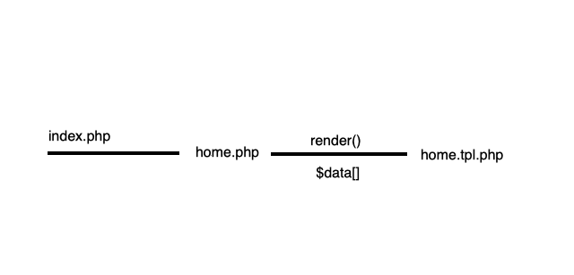

# Cas pràctic

## 1a Aplicació en PHP 

Anem a veure un exemple pràctic del que hem estudiat fins ara.

Punts a tenir en compte:

* _Separació de codi \(vista, fitxers i funcions \)_
* Connexió a base de dades tant en mysql i/o sqlite, opció configurable.
* Les accions de la nostra aplicació estaran en els scripts de la carpeta _controllers_

Cal preparar l'estructura en carpetes de l'aplicació:

```text
.htaccess
index.php
--/controllers
   login.php
   home.php
   register.php
   dashboard.php
--/src
   render.php
   connect.php
   schema.php
   |--/database
         database.sqlite
   |--/templates
          dashboard.tpl.php
          login.tpl.php
          register.tpl.php
          home.php
       
```

A connect.php hi posarem la connexió PDO, ja sigui mysql o bé sqlite \(depenent de les extensions\)

**`index.php`**, arrenca l'aplicació i carrega directament el controlador **home,** així com l'activació de la sessió.

```php
 <?php   
    //configuracio entorn
    session_start();
    //constant APP
    define('APP',__DIR__);
   // carreguem gestor de rutes    
    require APP.'/src/route.php';
    //enrutament
    $controller=getRoute();
    //redirigir a ruta capturada
    require APP.'/controllers/'.$controller.'.php';

```

La **navegació** interna de l'app és la següent:



**Index** crida a `home.php` \(controlador - encarregat de les accions de la pantalla inicial\) i aquest renderitza la plantilla **`home.tpl.php`** passant dades a través de l'array `$data[]`, actua com a controlador.

### Entorn

Al fitxer de configuració podem afegir els valors d'entorn de la nostra app.

```php
<?php
   
    
    $dbhost="127.0.0.1";
    $dbname='prova';
    $dbuser='prova';
    $dbpass='++++++++';
    $dsn='mysql:host='.$dbhost.';dbname='.$dbname.';';
    $driver='mysql';
```

### La connexió a la base de dades

Volem que la nostra activitat revisi la connexió a la base de dades amb dos drivers o controladors, amb sqlite i amb mysql. Òbviament les connexions seran diferents:

En el cas de SQLITE, es genera un fitxer en la ubicació indicada en el argument del PDO.

```php
//connect.php
<?php

    function connectSqlite(string $dbname){
        try{
            $db=new PDO('sqlite:'.__DIR__.'/database/'.$dbname.'.sqlite');
            $db->setAttribute(PDO::ATTR_ERRMODE,PDO::ERRMODE_EXCEPTION);
            $db->setAttribute(PDO::ATTR_DEFAULT_FETCH_MODE,PDO::FETCH_ASSOC);

        }catch(PDOException $e){
            die($e->getMessage());
    
        }
        return $db;

    }

    function connectMysql(string $dsn,string $userdb,string $passdb){
        try{
            $db = new PDO($dsn, $userdb, $passdb);
            $db->setAttribute(PDO::ATTR_ERRMODE,PDO::ERRMODE_EXCEPTION);
            $db->setAttribute(PDO::ATTR_DEFAULT_FETCH_MODE,PDO::FETCH_ASSOC);

        }catch(PDOException $e){
            die( $e->getMessage());
            
        }
        return $db;
    }
```

Per  gestionar la creació de la taula que utilitza la nostra app, podem utilitzar la funció **schemaGen\(\)**, que executa un comando de creació de taula, distingim també entre sqlite i mysql.

### **Controladors**

Encarregats de les accions de les pantalles o vistes, si tenim vista **home**, també tindrem controlador **home**.

A més el controlador passa dades a vista renderitzada com es pot comprovar a l'exemple:

```php
//controlador home.php
<?php
    //render vista

   require APP.'/src/render.php';
   // si està definida la sessió
   $uname=$_SESSION['uname'] ?? '';
   echo render('home',['title'=>'Home '.$uname]);
```

### Renderitzat de plantilles

La forma més elegant de treballar les vistes en PHP és separar codi PHP de codi HTML. Amb aquest mètode que presentem, es pot separar perfectament, ubicant una carpeta  **`templates`** amb plantilles renderitzables.

```php
<?php

    function render(string $tpl,?array $data=[]):string 
    {
        if($data){
            extract($data,EXTR_OVERWRITE);
        }
        ob_start();
        require 'src/templates/'.$tpl.'.tpl.php';
        $rendered=ob_get_clean();
        return (string)$rendered;
    }
```

El responsable del renderitzat és el controlador.  En el renderitzat, fem servir els ob \(output-buffer\). La seva missió és desar les dades que arriben a aquest buffer \( el fitxer de plantilla barrejat amb les dades extretes de $data\) i per últim retornar l'string que el controlador s'encarrega de mostrar :

```php
echo render('home',['title'=>'Home '.$uname]);
```

## Spoiler

I si volem més complexitat en el sentit de poder tenir més opcions d'accions i vistes? Ens queda crear un controlador frontal que discrimini segons les rutes capturades...Una cosa similar a això:

```php
// rutes http://app?url=controlador
<?php
    
    function getRoute():string
    {
        if(isset($_REQUEST['url'])){
             $url=$_REQUEST['url'];
        }else{
            $url="home";
        }
       
    
        switch ($url){
            case 'login': 
                return 'login';
            case 'register': 
                return 'register';
            case 'regaction': 
                return "regaction";
            case 'logaction': 
                return "logaction";
            case 'logout': 
                return "logout";
            default: 
                return 'home';
        }
            
    }
```

I per què sigui efectiva recurrirem a que sempre s'ha de consultar al index.php per saber quina ruta cal interpretart \(front controller\). Necessitem un .htaccess que reescrigui les URL:

```php
Options +FollowSymLinks

RewriteEngine On

RewriteCond %{REQUEST_FILENAME} -f [OR]
RewriteCond %{REQUEST_FILENAME} -d 

RewriteRule ^.*$ index.php [NC,L]
```

Si es demana per "algo" que no és ni fitxer ni directori, reescrivim la REQUEST\_URI per reenviar-la al index.php.


