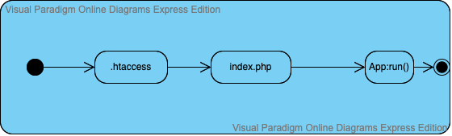

# Creació d'un framework

## Introducció

Aprofundim el coneixement de la programació orientada a objecte a través de la creació d'un marc de treball propi adaptant una aplicació.

En les aplicacions web és important resoldre els següents problemes :

* Captura del **REQUEST** del client
* Adaptar **resposta** al tipus de client \(HTML, JSON...\)

En el cas de seguir un paradigma MVC \(Model View Controller\), es poden adoptar els següents elements:

* Reescriptura del REQUEST per fer-lo més amigable \(**`.htaccess`**\)
* Captura a través del Request del controlador \(objecte\) i l'acció \(mètode\)
* Llençament de la instància de l'objecte controlador i posteriorment cridar l'acció corresponent com a mètode del controlador
* Manteniment de la sessió i sistema d'autenticació i autorització
* Sistema de plantilles per al renderitzat i generació de interfície d'usuari.


## **Funcionament bàsic de l'app \( paradigma MVC a nivell web\)**

#### **Estructura de carpetes i fitxers**

```php
/index.php
 config.json
 composer.json
 vendor/
 src/
 templates/
 public/
    css/
    img/
    js/
```

La carpeta src/ incorpora les classes bàsiques de funcionament, incloent App que és la classe mestra inicial.

La carpeta vendor/ inclou únicament la característica autoload de PSR-4.

templates/ incorpora totes les plantilles php-html que s'utilitzen a les vistes.

public/ incorpora les característiques estàtiques i de front-end de l'aplicació.

### **El Cicle REQUEST - RESPONSE**

Si seguim el cicle entre client i servidor, podem analitzar com es desenvolupa la resposta, aquesta es dona sempre a nivell de Controlador, ja que estem fent servir paradigmes MVC.



### **1 Reescriptura de la URI**

**.htaccess**

```text
Options +FollowSymLinks

RewriteEngine On

RewriteCond %{REQUEST_FILENAME} -f [OR]
RewriteCond %{REQUEST_FILENAME} -d 

RewriteRule ^.*$ index.php [NC,L]
```

Com s'observa, es tracta de redirigir tota consulta \(_query_ \) cap al controlador frontal de l'aplicació \(**index.php**\).

Per una bona càrrega de classes fem servir l'estandar **PSR- 4** \(autocàrrega de classes\)

**Adaptació a estàndar PSR-4 \(autoload\) composer.json segons el namespace utlitzat**

```text
{
    "autoload": {
        "psr-4":{
            "App\\": "src/"
        }
    }
```

### 2 Front controller  - index.php

El fitxer index.php del nostre projecte actua com a un frontend controller és a dir, totes les Requests, són dirigides a aquest script.

```php
<?php

    ini_set('display_errors','On');
   

    require __DIR__.'/vendor/autoload.php';
    
    use App\App;
    
    $conf=App::init();
    //constants d'enrutament i BBDD
    define('BASE',$conf['web']);
    define('ROOT',$conf['root']);
    define('DSN',$conf['driver'].':host='.$conf['dbhost'].';dbname='.$conf['dbname']);
    define('USR',$conf['dbuser']);
    define('PWD',$conf['dbpass']);

    App::run();
    
```

Un cop carregat el PSR-4, definim les constants de l'entorn de l'aplicació, aquestes són extretes del fitxer de configuració **config.json**

```php
{
    "conf_dev":{
        "driver":"mysql",
        "dbhost":"127.0.0.1",
        "dbname":"prouf1",
        "dbuser":"prouf1",
        "dbpass":"+++++++++",
        "web":"http://localhost:8000/",
        "root":"/"
    },
    "conf_pro":{
        "driver":"mysql",
        "dbhost":"toni.cesnuria.com",
        "dbname":"toni_prouf1",
        "dbuser":"toni_prouf1",
        "dbpass":"+++++++++",
        "web":"/m7/todofw/",
        "root":"/m7/todofw/"

    }
}
```

Al fitxer de configuració hi mostrem dos objectes json en funció de si estem en producció conf\__pro o en desenvolupament conf_\_dev.

### 3 App::run\(\)

Observem la classe src/App.php

```php
src/App.php
<?php

namespace App;

   use App\Request;
   use App\Session;

   final class App{
        static protected $action;
        static protected $req;

        private static function env(){
            $ipAddress=gethostbyname($_SERVER['SERVER_NAME']);
            if($ipAddress=='127.0.0.1'){
                return 'dev';
            }else{
                return 'pro';
            }
        }
        private static function loadConf(){
            $file="config.json";
            $jsonStr=file_get_contents($file);
            $arrayJson=json_decode($jsonStr);
            return $arrayJson;
        }
        static function init(){
            //read configuration
            $config=self::loadConf();
            //determinar env pro o dev
            $strconf='conf_'.self::env();   
            $conf=(array)$config->$strconf;
            return $conf;

        }
        public static function run(){

            $session=new Session();
            $routes=self::getRoutes();
           
            
            // obtenir tres parametres: controlador, accio,[parametres]
            // url friendly :  http://app/controlador/accio/param1/valor1/param2/valor2
            self::$req=new Request;
            $controller=self::$req->getController();
            
        
            self::$action=self::$req->getAction();
            
            self::dispatch($controller,$routes,$session);

        }
        
        private static function dispatch($controller,$routes,$session):void 
        {
            
            try{
                if(in_array($controller,$routes)){
                   
                   $nameController='\\App\Controllers\\'.ucfirst($controller).'Controller';
                   $objContr=new $nameController(self::$req,$session);
                   
                   //comprovar si existeix l'acció com mètode a l'objecte
                   if (is_callable([$objContr,self::$action])){
                       call_user_func([$objContr,self::$action]);
                   }else{
                       call_user_func([$objContr,'error']);
                   }

               }else{
                    throw new \Exception("Ruta no disponible");
                }
           }catch(\Exception $e){
               die($e->getMessage());
           }
        }
        /**
         *  @return array
         *  returns registered route array
         */
        static function getRoutes(){
            $dir=__DIR__.'/Controllers';
            $handle=opendir($dir);
            while(false !=($entry=readdir($handle))){
               if($entry!="." && $entry!=".."){
                   $routes[]=strtolower(substr($entry,0,-14));
               }
               
            } 
            return $routes;
        }
           
    
   }
```

El mètode init\(\), proporciona l'array de configuració de l'app. Mentre que run\(\) és en sí el nucli de l'aplicació, ja que determina i activa quin controlador és el responsable de la "request", cal destacar que en la instància del controlador, també injectem els objectes Session i Request, que ens facilita el desenvolupament de l'aplicació com ja s'observarà.


