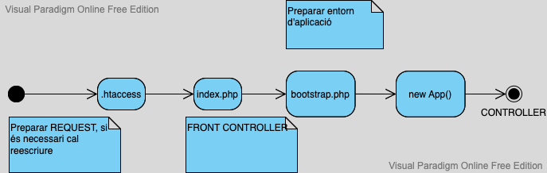

# Creació d'un framework

## Introducció

Aprofundim el coneixement de la programació orientada a objecte a través de la creació d'un marc de treball propi adaptant una aplicació.

En les aplicacions web és important resoldre els següents problemes :

* Captura del **REQUEST** del client
* Adaptar **resposta** al tipus de client (HTML, JSON...)

En el cas de seguir un paradigma MVC (Model View Controller), es poden adoptar els següents elements:

* Reescriptura del REQUEST per fer-lo més amigable (**`.htaccess`**)
* Captura a través del Request del controlador (objecte) i l'acció (mètode)
* Llençament de la instància de l'objecte controlador i posteriorment cridar l'acció corresponent com a mètode del controlador
* Manteniment de la sessió i sistema d'autenticació i autorització
* Sistema de vistes (_views_) per al renderitzat i generació de interfície d'usuari.


## **Funcionament bàsic de l'app ( paradigma MVC i altres ginys)**

#### **Estructura de carpetes i fitxers importants**

```php
/index.php
.env
 config.php
 composer.json
 bootstrap.php
 .htaccess
 vendor/
 src/
     Controllers/
     Database/
     views/
         partials/
 public/
    css/
    img/
    js/
```

La carpeta src/ incorpora les classes bàsiques de funcionament, incloent App que és la classe mestra inicial i l'arrencada del sistema (**bootstrap.php**)

La carpeta _vendor_/ inclou les llibreries externes que utilitzarem, entre elles la característica autoload de PSR-4.

```json
{ 
   "autoload":
   { 
     "psr-4": 
      {
         "App\":"src" }, 
         "files": ["src/helpers.php"] 
      }, 
      "require": { 
           "vlucas/phpdotenv":"^5.3", 
           "psr/container": "^1.0", 
           "ext-pdo": "*" 
        }
  }
```

&#x20;views incorpora totes les vistes php-html que s'utilitzen a les vistes.

public/ incorpora les característiques estàtiques i de front-end de l'aplicació.

### **El Cicle REQUEST - RESPONSE**

Si seguim el cicle entre client i servidor, podem analitzar com es desenvolupa la resposta, aquesta es dona sempre a nivell de Controlador, ja que estem fent servir paradigmes MVC



### **1 Reescriptura de la URI**

**.htaccess**

```
Options +FollowSymLinks

RewriteEngine On

RewriteCond %{REQUEST_FILENAME} -f [OR]
RewriteCond %{REQUEST_FILENAME} -d 

RewriteRule ^.*$ - [NC,L]
RewriteRule ^.*$ index.php [NC,L]
```

Com s'observa, es tracta de redirigir tota consulta (_query_ ) cap al controlador frontal de l'aplicació (**index.php**).

Per una bona càrrega de classes fem servir l'estandar **PSR- 4** (autocàrrega de classes) i a més afegim la clàusula files que permet accedir a fitxers de funcions _src/helpers.php_

### 2 Front controller  - index.php

El fitxer index.php del nostre projecte actua com a un frontend controller és a dir, totes les Requests, són dirigides a aquest script.

```php
<?php
    ini_set('display_errors', 'On');
    require __DIR__.'/vendor/autoload.php';
    require __DIR__ . '/bootstrap.php';

    use App\App;


    $config=require 'config.php';
    

    App::start();
    
```

Un cop carregat el PSR-4, definim les constants de l'entorn de l'aplicació, aquestes són extretes del fitxer de configuració d'entorn .**env** i del fitxer config.php. Les variables $\_ENV són extretes del fitxer .env, una forma de desar la nostra configuració de forma secreta.

```php
<?php


    return [
      'db'=>[
          'dbuser'=>$_ENV['DB_USER'],
          'dbpassword'=>$_ENV['DB_PASSWORD'],
          'connection'=>$_ENV['DB_DRIVER'].':host='.$_ENV['DB_HOST'],
          'dbname'=>$_ENV['DB_NAME'],
          'options'=>[
              \PDO::ATTR_ERRMODE=>\PDO::ERRMODE_WARNING
          ]
      ]
    ];
```


**Utilitzem la llibreria  vlucas/phpdotenv  des de composer.json.**



```php
DB_DRIVER='mysql'
DB_HOST='127.0.0.1'
DB_USER='++++'
DB_PASSWORD='++++++++'
DB_NAME='+++++++'
ROOT='/'
```

### 3 App::start()

Observem el fitxer boostrap.php, requerit per la nostra App, el que fa es registrar els serveis que utilitzarem dins l'aplicació.

```php
<?php


    $dotenv = \Dotenv\Dotenv::createImmutable(__DIR__);
    $dotenv->load();

    define('ROOT', $_ENV['ROOT']);
    use App\Database\QueryBuilder;
    use App\Database\Connection;
    use App\Registry;
    // register all the services
    

    Registry::bind('config', require 'config.php');
    
    Registry::bind('database', new QueryBuilder(
        Connection::make(Registry::get('config')['db'])
    ));
    
```

que requereix la classe Registry

```php
<?php

namespace App;

class Registry
{
    /**
     * All registered keys.
     *
     * @var array
     */
    protected static $services = [];

    /**
     * Bind a new key/value into the container.
     *
     * @param  string $key
     * @param  mixed  $value
     */
    public static function bind($key, $value)
    {
        static::$services[$key] = $value;
    }

    /**
     * Retrieve a value from the registry.
     *
     * @param  string $key
     */
    public static function get($key)
    {
        if (! array_key_exists($key, static::$services)) {
            throw new \Exception("No {$key} is bound in the container.");
        }

        return static::$services[$key];
    }
}
```

Fixem-nos en bootstrap, la seva funció és lligar aquests serveis de database i configuració per després ser utilitzats.

Ara, fixem la nostra atenció en la classe App

```php
src/App.php
<?php
    namespace App;

    use App\Request;
    

    final class App{
        static protected $action;
        static protected $req;


        static function start(){
            $session=new Session();
            $routes=self::getRoutes();
           
            
            // obtenir tres parámetres: controlador, accio,[parametres]
            // url friendly :  http://app/controlador/accion/param1/valor1/param2/valor2
            self::$req=new Request;
            $controller=self::$req->getController();
            
            self::$action=self::$req->getAction();
         
            self::dispatch($controller,$routes,$session);

        }
        
        private static function dispatch($controller,$routes,$session):void 
        {
            
            try{
                if(in_array($controller,$routes)){
                   // si es ruta de sistema es pot instanciar
                   // dispatcher
                   $nameController='\\App\Controllers\\'.ucfirst($controller).'Controller';
                   $objContr=new $nameController(self::$req,$session);
                   
                   //comprovar si existeix l'acció como mètode a l'objecte
                   if (is_callable([$objContr,self::$action])){
                       call_user_func([$objContr,self::$action]);
                   }else{
                       call_user_func([$objContr,'error']);
                   }

               }else{
                    throw new \Exception("Ruta no disponible");
                }
           }catch(\Exception $e){
               die($e->getMessage());
           }
        }
        /**
         *  register all available routes in controllers folder
         *  @return array $routes[]
         */
        static function getRoutes(){
            $dir=__DIR__.'/Controllers';

            $handle=opendir($dir);
            while(($entry=readdir($handle))!=false){
                if ($entry!='.' && $entry!='..'){
                    $routes[]=strtolower(substr($entry,0,-14));
                }
               
            }
            return $routes;
        }
    }
```

Mentre que start() és en sí el nucli de l'aplicació, ja que determina i activa quin controlador és el responsable de la "request", cal destacar que en la instància del controlador, també injectem els objectes Session i Request, que ens facilita el desenvolupament de l'aplicació com ja s'observarà.


## Elements de la carpeta src/

### Request

```php
<?php

    namespace App;

    class Request{
        private  $controller;
        private  $action;
        private $method;
        private  $params;

        protected $arrURI;
        
        function __construct(){
            $requestString=\htmlentities($_SERVER['REQUEST_URI']);
            //adaptar el sistema root a domini o carpeta
            $reqStr=$this->get_diff($requestString,ROOT);  
            //extract URI
            $this->arrURI=explode('/',$reqStr);
           
            $this->extractURI();
        }

        private function get_diff($a, $b){
            $c=substr($a,strlen($b));
            return $c;  
        }

        private function extractURI():void{     
            $length=count($this->arrURI);
            //estudi de casos possibles
            switch($length){
                case 1: //only controller
                    if($this->arrURI[0]==""){
                        $this->setController('index');
                    }else{
                        $this->setController($this->arrURI[0]);
                    }
                    $this->setAction('index');
                    break;
                case 2: //controller & action
                    $this->setController($this->arrURI[0]);
                    if($this->arrURI[1]==""){
                        $this->setAction('index');
                    }else{
                        $this->setAction($this->arrURI[1]);
                    }
                break;
                default: // cont. & act & params
                    $this->setController($this->arrURI[0]);
                    $this->setAction($this->arrURI[1]);
                    $this->Params();
                break;
            }
            $this->setMethod(\htmlentities($_SERVER['REQUEST_METHOD']));

        }
        
        private function Params():void{
            if($this->arrURI!=null){
                $arr_length=count($this->arrURI);
                if($arr_length > 2){
                    //quitar contr, y accion
                    array_shift($this->arrURI);
                    array_shift($this->arrURI);
                    $arr_length=count($this->arrURI);
                    if($arr_length % 2 == 0){
                        for($i=0;$i<$arr_length;$i++){  
                            if($i%2 == 0){
                                $arr_k[]=$this->arrURI[$i];
                            }else{
                                $arr_v[]=$this->arrURI[$i];
                            }
                        }
                        $array_res=array_combine($arr_k,$arr_v);
                        $this->setParams($array_res);
                    }

                }

            }
        }

        public function getController(){
            return $this->controller;
        }
        public function setController($controller){
            $this->controller=$controller;
        }
        public function getAction(){
            return $this->action;
        }
        public function setAction($action){
            $this->action=$action;
        }
        public function getMethod(){
            return $this->method;
        }
        public function setMethod($method){
            $this->method=$method;
        }
        public function getParams(){
            return $this->params;
        }
        public function setParams($array){
            $this->params=$array;
        }
    }
```

### Session

```php
<?php

    namespace App;

    final class Session {
        protected $id;
        public function __construct() {
    
            $status = session_status();
    
            if($status == PHP_SESSION_DISABLED) {
                throw new \LogicException('Sessions are disabled.');
            }
                if($status == PHP_SESSION_NONE) {
                session_start();
                $this->id=session_id();
            }
        }
    
        /**
         * Gets a session value associated with the specified key.
         *
         * @param string $key
         *
         * @return mixed|null Returns the value on success. NULL if the key doesn't exist.
         */
        public function get($key) {
            if(array_key_exists($key, $_SESSION)) {
                return $_SESSION[$key];
            }
            return null;
        }
    
        /**
         * Set a new session elements or update an existing one.
         *
         * @param string $key
         * @param mixed  $value
         */
        public function set($key, $value) {
            $_SESSION[$key] = $value;
        }
        public function unset($key){
            if ($this->exists($key)){
                unset($_SESSION[$key]);
            }
        }
    
        /**
         * Deletes a session element.
         *
         * @param string $key
         *
         * @return bool
         */
        public function delete($key) {
            if(array_key_exists($key, $_SESSION)) {
                unset($_SESSION[$key]);
                return true;
            }
            return false;
        }
    
        /**
         * Determines if a session key exists.
         *
         * @param string $key
         *
         * @return bool
         */
        public function exists($key) {
            return array_key_exists($key, $_SESSION);
        }

        public function destroy(){
            session_destroy();
        }
    
    }
```

### App

El nucli  o sistema de l'aplicació: que ja vam veure amb anterioritat.

### QueryBuilder i Connection

Accedir a la capa de persistència (infraestructura) és fàcil si fem servir aquesta classe, el podem definir com un servei que utilitzen els controladors.

Mirem el codi d'un controlador

```php
<?php

    namespace App\Controllers;

    
    use App\Registry;

class IndexController {

        public function index()
        {
            $roles = Registry::get('database')->selectAll('roles');
            
            return view('index', compact('roles'));
        }
    }
```

I ara observem les classes Connection i QueryBuilder:

```php
//Connection
<?php
    namespace App\Database;

    class Connection{
        public static function make($config){
          $dsn=$config['connection'].';dbname='.$config['dbname'];
            try {
                return new \PDO(
                   $dsn,
                    $config['dbuser'],
                    $config['dbpassword'],
                    $config['options']
                );
            } catch (\PDOException $e) {
                die($e->getMessage());
            }

        }
    }
    
    // QueryBuilder
<?php

namespace App\Database;
class QueryBuilder{
    private $selectables=[];
    private $table;
    private $whereClause;
    private $limit;
    protected $pdo;

    function __construct($pdo)
    {
        $this->pdo=$pdo;
    }

    function selectAll($table){
        $statement = $this->pdo->prepare("select * from {$table}");
        $statement->execute();
        return $statement->fetchAll(\PDO::FETCH_CLASS);
    }
    }
```

### FormBuilder

Es tracta de crear de forma semi-automàtica els formularis de la nostra app. Aquests es configuren des del controlador per poder ser renderitzats posteriorment.

```php
namespace App;
    

    class FormBuilder
    {
        private $elements = array();

        public function open($uri,$method=null){
            $method=$method??'POST';
            $this->elements[]="<form method=\"$method\" action=\"$uri\" >";
            return $this;
        }
        public function close(){
            $this->elements[]="</form>";
            return $this;
        }

        public function label($text) {
            $this->elements[] = "<label >$text</label>";
            return $this;
        }   

        public function input($type, $name, $value = null) {
            $value=$value??'';
            $this->elements[] = "<input type=\"$type\" class=\"form-control mb-3\" name=\"$name\" id=\"$name\" value=\"$value\" />";
            return $this;
        }   

        public function textarea($name, $value =null) {
            $value=$value??'';
            $this->elements[] = "<textarea name=\"$name\" id=\"$name\" >$value</textarea>";
            return $this;
        }
        public function submit($value=null){
            $value=$value??'Next';
            $this->elements[] ="<button type=\"submit\" class=\"btn btn-primary m-4\">$value</button>";
            return $this;
        }
        public function csrf($value){
            $this->elements[]="<input type=\"hidden\" name=\"csrf-token\" value=\"$value\">";
           
            return $this;
        }
        /**
         * Returns string when form is completed
         *
         * @return string
         */
        public function __toString() {
            return join("\n", $this->elements);
        }   
    }

```

I quan volem utilitzar el formulari, el configurem abans de renderitzar-lo, mirem l'exemple:

```php
 //UserController
 
  function login(){
            
            $form=$this->createForm();
            $form->open(BASE.'user/log')
                ->label('Email:')
                ->input('email','email')
                ->label('Password:')
                ->input('password','passw')
                ->csrf($this->session->get('csrf-token'))
                ->submit('Sign')
                ->close();

            $this->render([
                'form'=>$form],'login');
        }
```

El procés de configuració consisteix en crear l'objecte **$form**, i després es completa amb tots el items, afegirem també l'atribut ocult csrf-token per protegir-nos d'atacs **CSRF.**


## Procés de resposta

Anem a simular un procés de resposta:

Es tracta de mostrar un "escriptori" un cop s'ha autenticat l'usuari, és a dir provenim d'un procés similar aquest:

```php
'''La navegació en la app:'''

welcome --> login  ----> dashboard ---> add task
        --> register               ---> complete task
                                   ---> remove task
                                   ---> edit task
                                   ---> profile
        USERCONTROLLER          USER/TASKCONTROLLER
```

En l'autenticació el controlador UserController ens porta cap al controlador User i l'acció dashboard:

```php
//class UserController
function log(){
            if (isset($_POST['email'])&&!empty($_POST['email'])
            &&isset($_POST['passw'])&&!empty($_POST['passw']))
            {
                $email=filter_input(INPUT_POST,'email',FILTER_SANITIZE_EMAIL);
                $pass=filter_input(INPUT_POST,'passw',FILTER_SANITIZE_STRING);
            
           
                $user=$this->auth($email,$pass);
                if ($user){
                    $this->session->set('user',$user);
                    //si usuari valid
                    if(isset($_POST['remember-me'])&&($_POST['remember-me']=='on'||$_POST['remember-me']=='1' )&& !isset($_COOKIE['remember'])){
                        $hour = time()+3600 *24 * 30;
                        $path=parse_url($_SERVER['REQUEST_URI'],PHP_URL_PATH);
                        setcookie('uname', $user['uname'], $hour,$path);
                        setcookie('email', $user['email'], $hour,$path);
                        setcookie('active', 1, $hour,$path);          
                    }
                    header('Location:'.BASE.'user/dashboard');
                }
                else{
                    header('Location:'.BASE.'user/login');
                }
            
            }
        }
```

Fixem-nos en la línia 21:

```php
 header('Location:'.BASE.'user/dashboard');
```

Ens crea una REQUEST que demana una cosa similar a **`GET HTTP1.1 /user/dashboard`**

El sistema creat, ens porta a instanciar el controlador UserController i el mètode **dashboard**:

```php
// class UserController
function dashboard(){
            
            $user=$this->session->get('user');
            $data=$this->getDB()->selectAllWithJoin('tasks','users',['tasks.id','tasks.description','tasks.due_date'],'user','id');
            $this->render(['user'=>$user,'data'=>$data],'dashboard');
        }
```

En aquest punt, extreiem de la sessió la clau d'usuari que passarem a la vista a través del mètode render, a l'igual que les dades assignades a aquest usuari.

Mirem la plantilla:

```php
<?php
    include 'header.tpl.php';
    ?>
    <main>
    <section class="container">
        <h3>Todo list <?= $user['uname'];?></h3>
        <div class="row my-auto">
        <table id="mytable" class="table">
            <tr>
            <?php
                if($data){
                $columns=array_keys($data[0]);
                
                foreach ($columns as $field) {
                    echo '<th scope="row">'.$field.'</th>';
                }
                }
                
                ?>
                <th colspan="2"><strong>Actions</strong></th>   
            </tr>
        <?php
            if($data){
                foreach ($data as $row){
                    echo '<tr id="row'.$row["id"].'">';
                    foreach ($row as $column => $value) {
                       echo '<td contenteditable>'.$value.'</td>';
                    }
                    echo '<td><button class="btn btn-primary" id="update'.$row["id"].'" onclick="edit('.$row["id"].')">Update</button></td>';
                    echo '<td><button class="btn btn-danger" id="remove'.$row["id"].'" onclick="remove('.$row["id"].')">Remove</button></td>';
                    echo '</tr>';
                }   
            }
             
        ?>
        </table>
        </div>
        </section>
        <section>
        <a href="/task/new"><button class="btn btn-secondary"><strong>+</strong></button></a>
        </section>
        <section>
            <div id="message"><p></p></div>
        </section>
        
    </main>
    
<?php
    include 'footer.tpl.php';
    ?>

```

El sistema de plantilles creat és una simple composició entre tres scripts que es troben a **templates**. En aquesta plantilla en concret hem passat les dades $user i $data, des del controlador a través d'un array a l'argument de la funció **render** del controlador.

### El controlador

Proporciona la intermediación entre les capes de persistència i la UI, per tant és qui fa servir els serveis.&#x20;


```php
<?php

    namespace App\Controllers;

    
    use App\Registry;

   class IndexController {

        public function index()
        {
            $users = Registry::get('database')->selectAll('users');
            
            return view('index', compact('users'));
        }
    }
```

El controlador implementa les funcions render del helpers.php:

```php
//src/helpers.php
    /** Require a view.
     *
     * @param  string $name
     * @param  array  $data
     */
    function view($name, $data = [])
    {
        extract($data);

        return require "src/views/{$name}.view.php";
    }
```

Tots els processos segueixen aquest protocol&#x20;

usuari-->-Controlador --->render ---> procés UI --->usuari

