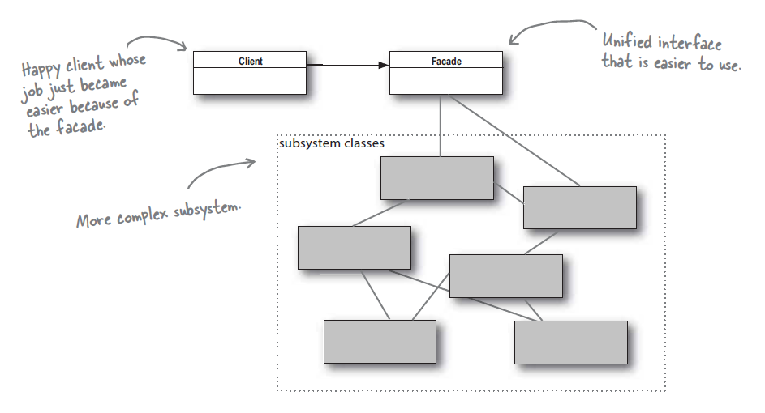

# Patrons de disseny aplicats

Amb els patrons de disseny aconseguim donar solució a problemes comuns basant-nos en programació orientada a objectes.

Cada patró és com un plànol que es pot personalitzar per resoldre un problema de disseny particular del codi.\*\* ([refactoring.guru](https://refactoring.guru))

Els que estudiarem com a part dels frameworks:

### Patrons estructurals

#### Despendency Injection

Es tracta d'un dels més utilitzats. Tal i com es defineix, permet desacoblar codi i permet un manteniment mínim i reusabilitat màxima.


#### Adapter

De tipus estructural, converteix la instància d'una classe en una altra esperada pel client. &#x20;


#### Decorator

#### Facade

És un patró de disseny estructural que proporciona una interfície simplificada (però limitada) a un sistema complex de classes, biblioteca o marc.

Delega les peticions del client als objectes apropiats dins del subsistema.  També s'encarrega de gestionar el seu cicle de vida. Tot això protegeix el client de la complexitat no desitjada del subsistema.

<figure><figcaption><p>Facade i els subsistemes</p></figcaption></figure>

El patró Facade s'utilitza habitualment a les aplicacions PHP per simplificar  el treball amb biblioteques o API complexes.&#x20;

### Patrons de comportament

#### Template Method

La idea d'aquest patró és molt simple, deixa que les subclasses d'una classe abstracta finalitzin els algoritmes de comportament.


#### Strategy

#### Chain of responsibility

Hi ha un nombre potencialment variable d'objectes "handler" o d'"elements de processament" o "node"s, i un flux de peticions que s'han de gestionar. Cobrir la necessitat de processar les sol·licituds de manera eficient sense les relacions i precedències del gestor principal, ni les assignacions de sol·licitud a gestor.

<figure><figcaption></figcaption></figure>

#### Observer

#### Mediator

És un patró de comportament que redueix l'acoblament de codi. Permet la comunicació indirecta entre dos objectes a través d'un objecte Mediador.

```php
// De refactoring.guru
<?php

namespace UF2\Mediator;

/**
 * The Mediator interface declares a method used by components to notify the
 * mediator about various events. The Mediator may react to these events and
 * pass the execution to other components.
 */
interface Mediator
{
    public function notify(object $sender, string $event): void;
}

/**
 * Elsobjectes Mediator implementen comportament cooperatiu, coordinant múltiples 
 * objectes
 */
class ConcreteMediator implements Mediator
{
    private $component1;

    private $component2;

    public function __construct(Component1 $c1, Component2 $c2)
    {
        $this->component1 = $c1;
        $this->component1->setMediator($this);
        $this->component2 = $c2;
        $this->component2->setMediator($this);
    }

    public function notify(object $sender, string $event): void
    {
        if ($event == "A") {
            echo "Mediator reacts on A and triggers following operations:\n";
            $this->component2->doC();
        }

        if ($event == "D") {
            echo "Mediator reacts on D and triggers following operations:\n";
            $this->component1->doB();
            $this->component2->doC();
        }
    }
}

/**
 * The Base Component provides the basic functionality of storing a mediator's
 * instance inside component objects.
 */
class BaseComponent
{
    protected $mediator;

    public function __construct(Mediator $mediator = null)
    {
        $this->mediator = $mediator;
    }

    public function setMediator(Mediator $mediator): void
    {
        $this->mediator = $mediator;
    }
}

/**
 * Concrete Components implement various functionality. They don't depend on
 * other components. They also don't depend on any concrete mediator classes.
 */
class Component1 extends BaseComponent
{
    public function doA(): void
    {
        echo "Component 1 does A.\n";
        $this->mediator->notify($this, "A");
    }

    public function doB(): void
    {
        echo "Component 1 does B.\n";
        $this->mediator->notify($this, "B");
    }
}

class Component2 extends BaseComponent
{
    public function doC(): void
    {
        echo "Component 2 does C.\n";
        $this->mediator->notify($this, "C");
    }

    public function doD(): void
    {
        echo "Component 2 does D.\n";
        $this->mediator->notify($this, "D");
    }
}

/**
 * The client code.
 */
$c1 = new Component1();
$c2 = new Component2();
$mediator = new ConcreteMediator($c1, $c2);

echo "Client triggers operation A.\n";
$c1->doA();

echo "\n";
echo "Client triggers operation D.\n";
$c2->doD();
p
```

### Patrons creacionals

#### Factory


