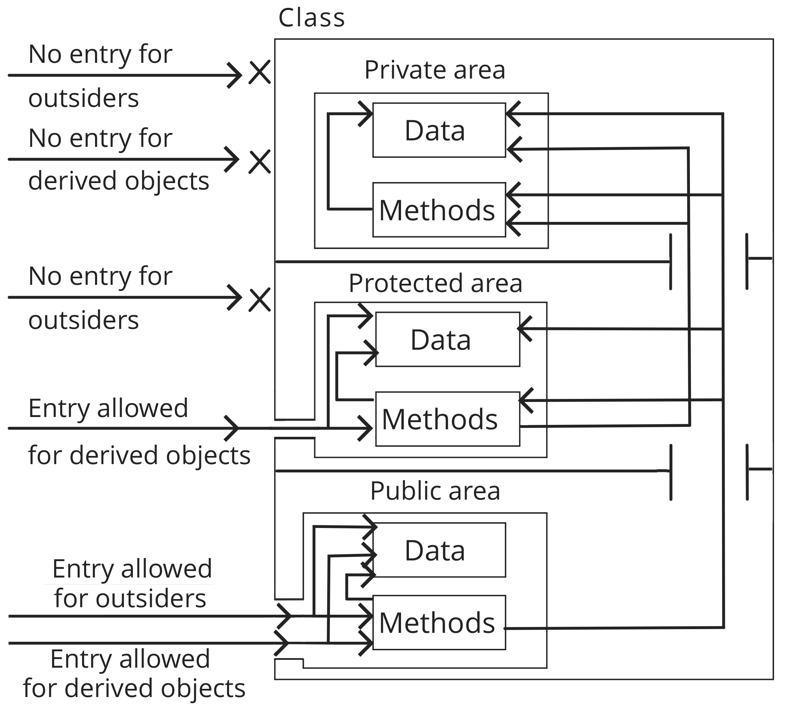

# Programació orientada a objecte

## Introducció

Per entendre l’ enfocament de  **programació orientat a objectes** \( **OOP** \), primer hauríem de començar discutint l’enfocament de programació orientat a **procediments**. L’enfocament procedimental és la forma convencional d’escriure codi en llenguatges d’alt nivell on es considera un problema una seqüència de coses a realitzar, com caminar, menjar, llegir, etc. Es poden escriure diverses funcions per realitzar aquestes tasques. L'enfocament processal, organitza un conjunt d'instruccions informàtiques en grups anomenats procediments, també coneguts com a **funcions**. 

En un programa multifunció, malgrat que les funcions poden albergar dades locals, es defineixen moltes dades importants com a dades globals. Algunes funcions poden funcionar amb aquestes dades globals i, per tant, es podrien convertir en vulnerables. A més, aquest enfocament pot no establir una forma segura d’interaccionar amb les dades mitjançant funcions.

La figura següent us mostra com funcionen les funcions en dades globals i com interaccionen entre elles:


Ara, l’enfocament orientat a l’objecte inclou diverses maneres de protegir les vostres dades lligant les dades més a prop de les funcions de manera que es poden evitar modificacions accidentals a les dades de funcions externes. El plantejament, per naturalesa, ens permet descompondre un gran problema en entitats més petites anomenades objectes i agrupar les dades i les funcions en aquests objectes. La figura següent mostra com les dades i les funcions s’organitzen en objectes:


Un enfocament de programació hauria de tractar grans preocupacions, com ara, com representem entitats problemàtiques de la vida real en un programa, com dissenyar un programa amb interfícies estàndard per interactuar amb funcions, com organitzar un programa en diversos mòduls de manera que puguem reutilitzar-los i amplieu-les més endavant, com afegir noves funcions a aquests mòduls i molt més. L'enfocament orientat a objectes es va desenvolupar per solucionar aquests problemes.

## Conceptes OOP

L'enfocament orientat a objectes tracta problemes de programació mitjançant els conceptes generalitzats que es proporcionen més endavant. En aquest punt, tractarem detalls d’aquests conceptes amb detall :

* Els **objectes** són entitats amb dades i **interfícies**. Poden representar una persona, un vehicle, un ventilador de taula o, potser, un compte bancari que tingui un paper important en el nostre programa. Les dades i les funcions \(o mètodes\) conviuen dins d’un objecte.
* Les **classes són plantilles** per crear objectes. Les dades són la descripció d’un objecte, mentre que les funcions són els comportaments d’aquest objecte, de manera que aquestes definicions de dades i mètodes es poden escriure mitjançant una classe. Les classes es poden denominar tipus de dades personalitzades.
* L'**encapsulació de dades és l'embalatge de dades** i funcions en una sola unitat, és a dir, en una classe. Imagineu-vos una càpsula inigualable amb dades i funcions encapsulades al seu interior de manera que el món exterior no pugui accedir a les dades sempre que no exposem mètodes per a elles. Aquest aïllament de les dades d’accés directe pel programa s’anomena amagada de dades. En definitiva, declarar una classe és l'encapsulat de dades.
* L’**abstracció** de dades és l’acte de representar propietats i característiques essencials sense donar detalls. Així doncs, la descripció de l'entitat continua sent abstracta i la responsabilitat de detallar l'entitat es pot fer a través del procés de creació o herència de l'entitat. Aquesta abstracció permet que tothom "segueixi les pautes i ho faci de la vostra manera".
* La **herència** és el procés d’adquisició de propietats i comportaments d’una altra classe de manera que les propietats i comportaments comuns es poden reutilitzar de manera jeràrquica.
* El **polimorfisme** és el concepte d’utilitzar la mateixa definició per a múltiples propòsits. Per exemple, volar és un comportament polimòrfic, ja que els ocells i els avions tenen les seves diferents maneres de volar.
* L’enllaç dinàmic \(dynamic linking\) és l’enllaç d’una crida de funció al codi que s’executarà en resposta a la crida de funció. Amb aquest concepte, es desconeix el codi associat a la funció donada fins que es faci la crida en temps d'execució. Diguem que diversos objectes implementaven la mateixa funció de manera diferent i en temps d'execució es cridaria  el codi que coincideix amb l'objecte al qual es feia referència.
* El **missatge** és la manera en què els objectes interactuen entre ells. Es tracta d’especificar el nom de l’objecte, el nom dels mètodes i la informació que s’ha d’enviar. Per exemple, si un cotxe és un objecte, canviar la velocitat és un mètode i la velocitat en quilòmetres per hora és el paràmetre de velocitat que cal superar. El món exterior utilitzarà l’objecte del cotxe per enviar el missatge de “velocitat de canvi” a aquest paràmetre. La figura següent representa els conceptes anteriors mitjançant una analogia del vehicle:


Hi ha molts tipus diferents de vehicles, com ara cotxes, autobusos, motocicletes, avions i molts més. Els vehicles tenen propietats generals com ara marca, model, color, rodes, mida del motor, etc. Aquestes són les propietats comunes que es troben en subtipus o classes de vehicles també. Atès que els cotxes, autobusos, motocicletes, etc., comparteixen una llista comuna de propietats, aquestes propietats i comportaments comuns provenen de la classe progenitora i cada subclasse afegeix les seves pròpies propietats i comportaments. Per exemple, els cotxes tenen quatre rodes i les motocicletes són de dues rodes, els cotxes tenen més capacitat de passatgers que una moto, etc. Per tant, aquestes desviacions dels tipus de vehicles haurien de situar-se a les seves pròpies subclasses de vehicles. Així, podem heretar propietats comunes i anar afegint les nostres pròpies propietats utilitzant conceptes orientats a objectes.

### Classes

Una classe és un model d'un objecte. Quines dades ha de contenir un objecte i quins mètodes es necessiten per accedir a aquestes dades es poden descriure mitjançant una classe. Una classe actua com una plantilla per a la creació d'objectes. Penseu com a guia,  un cotxe dissenyat amb un model. El tipus de vehicle, la marca, el model, la mida del motor, el color, etc. es defineixen a la classe `Car` juntament amb els mètodes per recuperar aquesta informació, com ara obtenir el nom del model, engegar el motor, etc.

Una classe comença amb la paraula clau**`class`**seguida del nom indicat i el cos inclòs en un parell de claus. El **cos** de la classe allotja els membres de la classe i són variables, constants, funcions, variables de classe \(també conegudes com a propietats de classe o atributs de classe\) i les funcions que pertanyen a la classe, conegudes com a mètodes de classe.

Mireu l'exemple de la següent declaració de classe:

```php
class ClassName
{
 // Cos de la classe
}
 // o
class ClassName
{
 // Declaracions de variables de classe
 // Declaracions de mètodes de classe
}
```

El nom de la classe comença amb lletres o guions baixos seguits de qualsevol nombre de caràcters alfanumèrics i de guions baixos. Noms de PHP predefinides classe, constants i paraules clau reservades - per exemple, **`break`, `else`, `function`, `for`, `new`**, i així successivament - no es poden utilitzar com a nom de la classe.

Aquesta és la llista de [paraules reservades](https://www.php.net/manual/en/reserved.php) a PHP.

A les recomanacions dels estàndards de PHP, **PSR-1** recomana que es declari un nom de classe  `CamelizedClassName`i es decretin mètodes de classe `camelizedMethodName`. Tinguem en compte el CamelCase del _nom_ de la _classe_ i l'ús de minúscules al començament dels noms del mètode. Feu clic a [PSR-1: Standard Coding Standard](https://www.php-fig.org/psr/psr-1/) per obtenir més informació.

Vegem la següent classe `Person` :

```php
class Person
{
   public $nom = "Pep Guardia";
   function sayHello()
   {
        echo "Hola!";
   }
}
```

Aquí hi la classe `class Person {…}`. S'ha afegit un atribut únic amb la línia `public $nom= 'Pep Guardia';`i el cos també conté el mètode `sayHello()`, que imprimeix una cadena senzilla.

A la següent secció, discutirem com hem **d’instanciar** una classe i què passa a la memòria quan realitzem aquesta instància.

### Instanciar una classe

Un objecte és una **instància d’una classe**, per tant, iniciar una classe significa crear un objecte nou mitjançant la classe. Podem iniciar una classe mitjançant la paraula `new`de la següent manera:

```php
$object = new MySimpleClass();
```

Amb la instanciació, un objecte es crea a la memòria amb còpies dels seus propis atributs. Aquí, la variable `$object` no conté l'objecte real; més aviat, assenyala l'objecte. Només per quedar clar, la variable`$object` és un punter a l'objecte i no té una referència a l'objecte.

El mètode del **constructor** es crida automàticament si es declara. Un constructor de classe i un destructor són dos tipus especials de mètodes; per exemple, **`__construct()`**i **`__destruct()`**, que es criden  automàticament en la  creació i supressió d’objectes, respectivament.

Per accedir a les propietats i mètodes d'un objecte, podem utilitzar l'operador d'objectes **`->`**, com en els següents casos:

```php
$object->propertyName;
$object->methodName();
```

### Atributs de classe

Com ja hem vist, els atributs i variables de classe contenen dades. Per escriure un atribut de classe en PHP, cal començar amb les paraules clau `public`, `private`o `protected`, i a continuació, la resta, és la instrucció d'assignació de variable de PHP. A l'exemple anterior, a la classe `Person`,  **`public $name = 'Pep Guardia'`**`;`s'utilitzava per assignar el nom d'una persona; aquí, `public` és un modificador **d’accés** o paraula clau de **visibilitat** del membre de classe i s’ha utilitzat de manera que es pot accedir a l’atribut **fora de la classe**. Discutirem detalladament els modificadors d’accés en punts posteriors.

Tingueu en compte que l'estructura de la classe es compila abans de l'execució del fitxer PHP. Quant a l'assignació de valors en atributs de classe, el valor ha de ser **estàtic**, és a dir, **el valor no ha de dependre del temps d'execució.** Per exemple, els atributs de classe següents no funcionaran:

```php
public $date = getdate();
public $sum = $a + $b;
```

Aquí, els atributs depenen del retorn de la funció `getdate()` i d'una avaluació de l'expressió aritmètica, respectivament, ja que la crida a la funció i l'avaluació de l'expressió aritmètica no es realitzaran durant el temps de compilació i  no es poden avaluar en temps d'execució, per la qual cosa  no funciona  en el cas dels atributs de classe.

Per tant, els atributs de classe que no impliquen informació en temps d'execució haurien de ser considerats un bon atribut, com ara el següent:

```php
public $num = 10
public $str = 'I am a Fruit';
public $arr = array('Apple', 'Mango', 'Banana');
```


**Visibilitat**

Les paraules clau  \(public, protected, private\) determinen com és l'accesibilitat a aquestes propietats/mètodes :

* **public**: accesible des de qualsevol lloc.
* **protected**: accessible per la classe i subclasses.
* **private**: només accesible per la classe.

Una propietat sempre s'ha de definir amb una d'aquestes pararules clau. 

Un mètode sense cap definició d'accesibilitat és per defecte public.


Vegem un exemple:

```php
<?php
class MyClass {
  public $var1 = 'public var';
  protected $var2 = 'protected var';
  private $var3 = 'private var';

  function printHello() {
    echo $this->var1 . '<br>';
    echo $this->var2 . '<br>';
    echo $this->var3 . '<br>';
  }
}

$obj = new MyClass();
echo $obj->var1 . '<br>'; // var1 es public
$obj->printHello(); // ho mostra tot, accés public a través de funció

// aixó produiria errors, per què?
/*
* echo $obj->var2; // Fatal Error
* echo $obj->var3; // Fatal Error
*/
```

### constants de classe

Les constants es poden definir usant [  'const'](https://www.logicbig.com/tutorials/misc/php/php-cheat-sheet.html#constants) , es poden definir dins una classe. La visibilitat de les constants de classe és pública.

Les constants s’assignen una vegada per classe i no per a cada instància de classe.

```php
class SampleClass
{
     const ONE = 1;
     const NAME = 'Joan Dani';
}
echo SampleClass::ONE; //1
echo SampleClass::NAME; //John Dani
```

**Operador d'abast \(::\)**

En comptes  d'utilitzar **-&gt;** , el doble punt permet accedir a la part estàtica i constant. Aquest operador també s'utilitza per accedir a les funcions de super classe **`parent::.`**

###  **'self' i this**

En comptes d'utilitzar **$this** , s'utilitza la paraula clau **self** per accedir a constants de la classe. En general, per a tots els accessos nivell de classe  utilitzem **self,**  per les instàncies de classe utilitzem **$this**.

```php
class SampleClass
{
    const ONE = 1;
    const NAME = 'Joana C';
    function printName()
    {
        echo self::NAME;
    }
}
echo SampleClass::NAME; //Joana C

```

```php
class Person
{
     public $name;
     function getName()
     {
        return $this->name;
     }
     function setName()
     {
        $this->name = 'Joana C';
     }
}
```

Els atributs també són accessibles des de dins dels mètodes amb **`$this`**.

```php
.....
function sayGreetings()
     {
          if (date('G') < 12)
          {
              $greetings = 'Good Morning';
          }
          elseif (date('G') < 17)
          {
              $greetings = 'Good Afternoon';
          }
          else
          {
              $greetings = 'Good Evening';
          }
          echo "$greetings $this->name! ";
      }
```

### Setters i getters

Quan parlem de setters i getters estem parlant d'encapsulament, el detalls dels objectes estan encapsulats \(**private** o **proctected**\) i és necessari accedir-hi a través de mètode públic.

### Mètodes màgics

Els noms dels mètodes [\_\_construct \(\)](https://www.php.net/manual/es/language.oop5.decon.php#object.construct) , [\_\_destruct \(\)](https://www.php.net/manual/es/language.oop5.decon.php#object.destruct) , [\_\_call \(\)](https://www.php.net/manual/es/language.oop5.overloading.php#object.call) , [\_\_callStatic \(\)](https://www.php.net/manual/es/language.oop5.overloading.php#object.callstatic) , [\_\_get \(\)](https://www.php.net/manual/es/language.oop5.overloading.php#object.get) , [\_\_set \(\)](https://www.php.net/manual/es/language.oop5.overloading.php#object.set) , [\_\_isset \(\)](https://www.php.net/manual/es/language.oop5.overloading.php#object.isset) , [\_\_unset \(\)](https://www.php.net/manual/es/language.oop5.overloading.php#object.unset) , [\_\_sleep \(\)](https://www.php.net/manual/es/language.oop5.magic.php#object.sleep) , [\_\_wakeup \(\)](https://www.php.net/manual/es/language.oop5.magic.php#object.wakeup) , [\_\_toString \(\)](https://www.php.net/manual/es/language.oop5.magic.php#object.tostring) , [\_\_invoke \(\)](https://www.php.net/manual/es/language.oop5.magic.php#object.invoke) , [\_\_set\_state \(\)](https://www.php.net/manual/es/language.oop5.magic.php#object.set-state) , [\_\_clone \(\)](https://www.php.net/manual/es/language.oop5.cloning.php#object.clone) i [\_\_debugInfo \(\)](https://www.php.net/manual/es/language.oop5.magic.php#object.debuginfo) són màgics en les classes PHP.

#### [\_\_toString \(\)](https://www.php.net/manual/es/language.oop5.magic.php#object.tostring)

`public` **`__toString`** `( void ): cadena`

El mètode [\_\_toString \(\)](https://www.php.net/manual/es/language.oop5.magic.php#object.tostring) permet a una classe decidir com comportar-se quan se li tracta com un string. Per exemple, el que _**echo  $obj;**_ mostraria. Aquest mètode ha de retornar un string, si no s'emetrà un nivell d'error fatal **`E_RECOVERABLE_ERROR`**.

#### Sobrecàrrega de propietats

[\_\_set \(\)](https://www.php.net/manual/es/language.oop5.overloading.php#object.set) s'executa a l'escriure informació sobre propietats inaccessibles \(protegides o privades\) o inexistents.

[\_\_get \(\)](https://www.php.net/manual/es/language.oop5.overloading.php#object.get) s'utilitza per consultar dades a partir de propietats inaccessibles \(protegides o privades\) o inexistents.

[\_\_isset \(\)](https://www.php.net/manual/es/language.oop5.overloading.php#object.isset) es llança a l'trucar a [isset \(\)](https://www.php.net/manual/es/function.isset.php) o [empty \(\)](https://www.php.net/manual/es/function.empty.php) sobre propietats inaccessibles \(protegides o privades\) o inexistents.

[\_\_unset \(\)](https://www.php.net/manual/es/language.oop5.overloading.php#object.unset) s'invoca quan es fa servir [unset \(\)](https://www.php.net/manual/es/function.unset.php) sobre propietats inaccessibles \(protegides o privades\) o inexistents.  


```php
public __set ( string $name , mixed $value ) : void
public __get ( string $name ) : mixed
public __isset ( string $name ) : bool
public __unset ( string $name ) : void
```

### Constructors i destructors

En el procés de creació o instanciació de classe, podem utilitzar el mètode màgic **`__construct()`**.

```php
class MyClass
{
    public $name;
    function __construct($username)
    {
         $this->name = $username;
    }
}
```

La idea clau darrere de l’ús d’un mètode `__construct()` és realitzar el conjunt inicial d’execucions que cal fer immediatament després de la creació d’objectes. En l'enfocament simple anterior, un `__construct()` realitza assignacions d'atributs.

## Destructor

El mètode destructor, `__destruct()`s'invoca automàticament quan es destrueix un objecte. Quan eliminem un objecte o potser un script PHP finalitza la seva execució i allibera la memòria utilitzada per les variables, es crida a   `__destruct()`.

La sintaxi d'un destructor de classes és la següent:

```php
class Person
{
    //atributs i  metodes
    function __destruct()
    {
        echo 'L\'objecte s''\ha elminat ';
    }
}
```


### Herència

El fet de poder fer que una classe  filla heredi atributs i mètodes d'una altra classe que en direm pare, d'això se'n diu herència.

L'herència es pot considerar un tipus de relació entre classes. Aquestes classes filles heredaran tots els atributs i mètodes no privats de la classe pare.


### Modificadors d'accés

Els dos conceptes bàsics que es troben al centre de l’OOP són la **modularitat** \(que permet la reutilització\) i l’ **encapsulació** \(que agrupa dades i mètodes per ocultar informació\). 

 Els modificadors d’accés proporcionen **protecció d’accés** per a constants d’objecte, atributs i mètodes. 



### Mètodes i atributs estàtics


Abstracció de classe

### Interfaces

Representen una part important del paradigma OOP. A vegades es pot confondre amb les classes abstractes, però a diferència d'elles, representen un contracte, totes les classes que implementin la `interface` estan obligades \(per contracte\) a implementar els mètodes que estan declarats a la interface.


Classes Abstractes i interfaces

Sobrecàrrega de mètodes.!!

Traits

#### **Namespace**

Els espais de noms permeten facilitar la comprensió del codi, de les classes i la seva ubicació.

Autoloading

## Relacions entre objectes

A més a més  de l'herència i la implementació , que ja hem vist, hi ha altres tipus de relacions entre objectes de les que no hem parlat encara.


