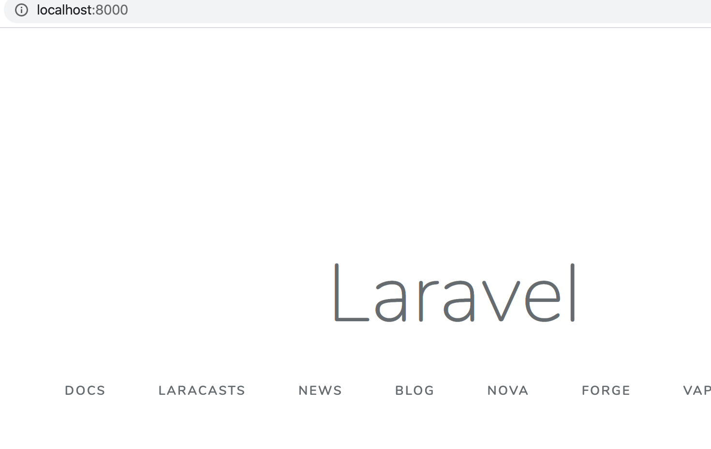
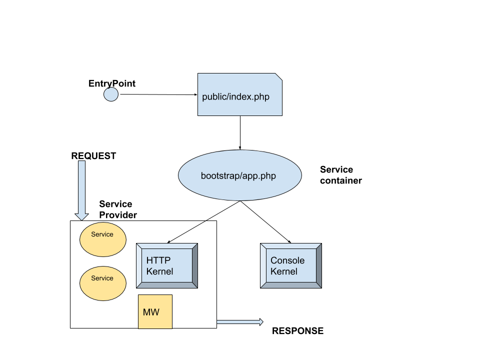
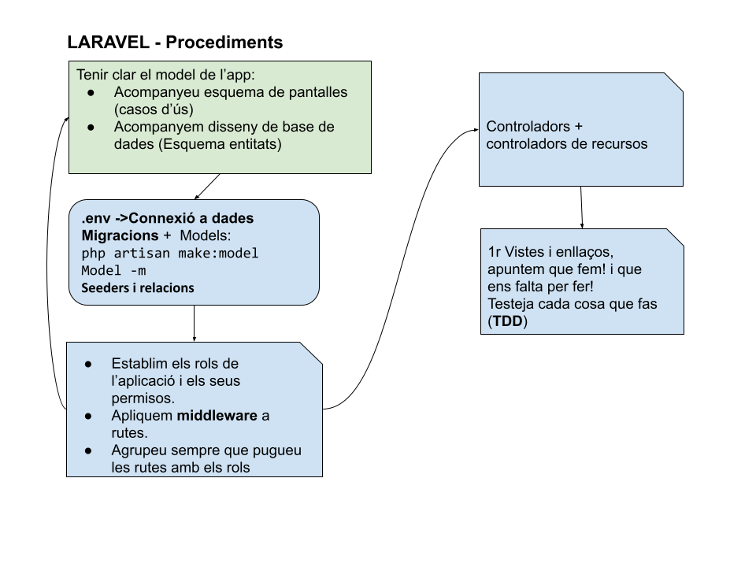

# Introducció a Laravel

## Què és?

Laravel és una eina que ens ajuda a desenvolupar sistemes web , pot ser un sistema, pàgina web o un API. A aquest tipus d'eines li diem Framework i és un entorn de treball o eina estandaritzada en quant a concepte, bones pràctiques, funcionalitats comunes i estil per resoldre algun tipus de problema.

## Introducció

Com tots el frameworks, el seu gran avantatge és que ja té moltes coses resoltes, l'inici de sessió i registre, paginació de les dades, la connexió i consulta a la base de dades, el sistema de cache, les rutes, el sistema de plantilles, la seguretat i moltes coses més.

Hem d'entendre'l com un sistema de capes i depenent del problema has de saber quina capa tractar.

* Podem crear una ruta i llençar vistes de d'allà (estàtic)
* O crear una ruta , aquesta apunti al controlador i des d'allà crear una vista en pantalla.
* O seguint el cas anterior pots agregar una capa de seguretat intermitja i si estàs loguejat aleshores el sistema et deixa anar al controlador i llençar la vista pertinent.

### Requeriments

Què és el que necessitem per treballar am Laravel:

* PHP v.7.2 o més gran
* Apache o nginx
* Sistema gestor de base de dades: MySql o MariadB
* Composer
* Git
* Editor de codi
* Navegador

## Instal·lació

A través de composer com a projecte:

```
composer create-project --prefer-dist laravel/laravel projecte
```

També es podria haver fet de forma global i utilitzar després el comando **laravel**.

```
composer global require laravel/installer
```

I per tant, poder crear projectes a través de comando

```
laravel new projecte
```

#### Servidor local de desenvolupament

Laravel disposa, a través del seu comando **artisan**, un servidor local per a desenvolupar.

```
cd projecte
php artisan serve
Laravel development server started: http://127.0.0.1:8000
[Mon Mar  2 20:59:15 2020] PHP 7.4.3 Development Server (http://127.0.0.1:8000) started
```



## Estructura de carpetes

**Arrel del projecte**: app, bootstrap, config, database, public, resources, routes, storage, tests, vendor.

**Dins d'app**: Broadcasting, Console, Events, Exceptions, Http, Jobs, Listeners, Mail, Notifications, Policies, Providers, Rules.


Amb el temps adquirirem l'habilitat de crear qualsevol estructura de carpetes, la que millor s'adapti al projecte que implementem.


### App

És la carpeta on desenvolupem l'apicació, és on escriurem el nostre codi PHP.

Aquí dins trobem una varietat important de carpetes com **Console, Http, Exceptions y Providers**. En **Console** tenim els nostres comandos personalitzats de **Artisan** i en **Http** creem els nostres controladors, middlewares i processaments de Requests, tot el relacionat amb el HTTP.

### Arxiu .env

Totes les dades configurables de l'entorn i ecosistema de Laravel es poden configurar a través d'aquest fitxer. Es tracta d'un fitxer que es pot repetir per cada ecosistema on es vulgui establir, ja sigui en producció `.env` en proves **`.env.testing`**, etc.

Entre d'altres coses que podem emmagatzemar, tenim la configuració de la base de dades, usuari, host, base de dades i password (no és visible, no ens preocupem).

També es pot desar la KEY (encriptada) del programa, generada en el moment d'instal·lació i modificable en qualsevol instant, que s'utilitza per per exemple, generar el token per evitar atacs CSRF.

### Configuració

En la carpeta config, establim tots els arxius de configuració que necessitem en l'aplicació. Exemple d'arxiu que retorna element de configuració:

```php
<?php
    return ['color'=>'#04a23e'];
```

## RECORDATORI: Cicle de vida del REQUEST

Des que el client envia un REQUEST fins que el sistema envia un RESPONSE, Laravel té com a punt d'entrada del tractament del REQUEST el fitxer \*\*public/index.php, \*\*on hi ha la preparació de l'entorn del sistema. Posteriorment s'envia cap a **bootstrap/app.php**, que actua com a contenidor de serveis ( \_service container \_). Aquest actua com a controlador frontal i reenvia cap als kernels o nuclis, bàsicament HTTP Kernel API kernel i Console Kernel, que acuten com a proveïdors de serveis (**service providers**).

Els kernels fan servir el _**middlewares**_ com a filtres específics de les REQUESTS, per exemple un MW verifica si l'usuari s'ha autenticat i actúa en conseqüència, redirigint cap a la pantalla de login o una altra. El tractament final el fa el servei (_service_) que permet obtenir una resposta (RESPONSE)



### Comencem a conèixer

Repassem cada carpeta dins **d'app** i després continuem amb les carpetes de l'arrel.

#### \*\*Broadcasting \*\*

Aquesta carpeta es genera amb el comando `php artisan make:channel`. La usarem si necessitem canals de transició d'esdeveniments.

#### Console

Aquí trobem als nostres comandos personalitzats de artisan. Si en el futur vols crear\_ \_un comando personalitzat treballaràs en aquesta carpeta. Les classes que seran allí les pots generar amb el comando `php artisan make:command`.

En aquesta carpeta trobem a l'arxiu **kernel.php**, és allí on registrem als nostres comandos.

#### Events

Aquesta carpeta es crea quan usem el comando `php artisan event:generate` i `php artisan make:event`.

Aquí guardem a les nostres classes d'esdeveniments que generin alertes després d'executar una acció.

#### Exceptions

Aquí configurem a les nostres classes que es dediquin a respondre a qualsevol cosa que passi. Ja existeix i compta amb el manejador d'excepcions, aquí creem qualsevol control d'excepció. Quan comencem a programar, ens quedem amb la configuració estàndard.

#### Http

Aquí tenim als nostres Controllers, Middleware i Form Requests, aquí es troba gairebé tot el nostre sistema ja que des d'aquí manegem les sol·licituds HTTP.

#### Jobs

Aquesta carpeta es crea quan usem el comando `php artisan make:job`. Aquí emmagatzemem a les nostres classes dedicades al control de cues de treball. Podem crear una cua de les tasques més pesades per a executar després, això ajuda moltíssim al rendiment del nostre sistema.

#### Listeners

Aquesta carpeta es crea quan usem el comando `php artisan event:generate` i `php artisan make:listener`. Aquí guardem a les nostres classes que manejaran els nostres esdeveniments (els events i els listeners treballen junts). Els listeners s'executen quan un esdeveniment l'ordeni. Per exemple, un esdeveniment de registre de client pot manejar l'esdeveniment d'email de benvinguda.

#### Mail

Aquí tindrem a les classes que representen a un email, es crea quan usem el comando `php artisan make:mail`. Per exemple l'email de benvinguda que acabo d'esmentar seria configurat aquí.

#### Notifications

Aquesta carpeta es crea quan usem el comando `php artisan make:notification`. Aquí tindrem a les nostres notificacions guardades perquè siguin enviades pel nostre sistema quan es necessiti. Les notificacions podrien ser un missatge de text, emails, guardades en base de dades per a mostrar a l'usuari, etc. Quan la campana de twitter s'encén és perquè una notificació el va generar.

#### Policies

Aquesta carpeta la podem crear amb el comando `php artisan make:policy`. Aquí guardarem a les nostres classes dedicades a les polítiques d'autorització. Podràs determinar si un usuari compta amb la facultat d'eliminar articles per exemple.

#### Providers

Aquí tenim als famosos proveïdors de serveis, aquests enllacen als components amb Laravel. Podem crear els nostres propis providers en aquesta carpeta i usar-ho des de Laravel. En general quan instal·lem un paquet, est ens diu com connectar a Laravel amb el seu _provider_.

#### Rules

La podem crear amb el comando `php artisan make:rule`. Aquí registrem regles de validació pròpies o personalitzades. Bootstrap Podria ser bootstrap o bootstrapping, sempre que vegis aquesta paraula has de saber que fa referència a l'inici d'un sistema informàtic. En aquest cas bootstrap/app.php inicia a Laravel. Aquí també trobes una carpeta anomenada cache que conté arxius de rutes i serveis generats pel sistema per a optimitzar-los i millorar el rendiment.

#### Config

Aquí trobarem tots els arxius de configuració del nostre sistema. De fet quan puguem crear paquets desarem els nostres arxius de configuració en aquesta carpeta. Aquí aconseguirem els arxius de l'aplicació, base de dades, cache i molts altres.

#### Database

El directori database conté les migracions de la base de dades, model factories i seeders. Si volem, també podem usar aquest directori per a emmagatzemar una base de dades SQLite.

#### Public

Aquí trobem a l'arxiu index.php, és el punt d'accés de totes les sol·licituds i mai treballem amb aquest arxiu directament, també podem trobar a les imatges, els arxius JS i els documents d'estils **CSS**. “Tot el públic estarà en aquesta carpeta”.

#### Resources

Aquí guardarem a les nostres vistes i arxius originals de LESS, SASS, Stylus o JS, també trobarem els arxius de configuració d'idioma.

#### Routes

Aquí tindrem totes les rutes del nostre sistema. Immediatament trobem els següents arxius:

1. web.php
2. api.php
3. console.php
4. channels.php.

Vegem un a un amb les explicacions d'una manera senzilla.

**WEB**. Les rutes configurades en l'arxiu web.php comptessin amb un estat de sessió, protecció de formularis CSRF i l'encriptació estàndard de cookies. Sempre treballarem aquí.

**API**. En api.php configurarem a les rutes que precisament tinguin a veure amb l'accés a un API, en fer-ho immediatament comptarem amb una limitació de velocitat i la seguretat pròpia i estàndard d'un API. El que aquí configurem estarà preparat per a treballar amb tokens d'accés i no l'estat de sessió com en web.php.

**Console**. En console.php definim tots els accessos que seran basats en comandos o des d'un terminal. Cada ruta és un Closure enllaçat a una acció. Configurar aquí algunes rutes ens ajudarà a treballar de manera simple la interacció amb mètodes d'entrada i sortida.

**Channels**. En channels.php registrem canals per a emetre transmissions d'esdeveniments. Entre altres coses aquí treballarem quan estiguem interessats a configurar notificacions del costat del client quan alguna cosa succeeix en el servidor.

#### Storage

Storage significa “emmagatzematge”, això dóna una idea de la seva utilitat i aquí trobem a les plantilles compilades de Blade, sessions basades en arxius, arxius de cache i altres arxius generats pel Framework, és molt comú usar aquesta carpeta per a guardar a les nostres imatges que després accedim des de public a través d'un enllaç simbòlic “accés directe”.

Dins trobarem a les carpetes app, framework i logs.

1\. La carpeta app la usem per a desar qualsevol arxiu generat amb intenció com les imatges, els PDF, etc.

2\. En framework aconseguim als arxius generats per Laravel i a la cache.

3\. Finalment logs, aquí veurem als famosos arxius .log amb la informació de registre generada. Tests Quan treballem amb la metodologia TDD o usem a PHPUnit treballem en aquesta carpeta.

Si estem començant en aquest món de la programació no toquem aquesta carpeta perquè programem d'una forma senzilla. Vendor És una carpeta estàndard en els projectes PHP, aquí es guarden totes les dependències generades per Composer.

### Routes (rutes)

Defineixen a qui/quins serveis cridem quan se solicita una determinada URI.

Totes les rutes es troben definides en un fitxer _`routes/web.php,`_` ``` totes, es troben aquí definides.

A través de les rutes, podem donar servei als mètodes REQUEST **get, post, put i delete**.​ Podem dir que respongui a un mètode determinat, un conjunt de mètode o bé a qualsevol.



```php
// ruta estàtica
Route::get('/', function () {
    return view('welcome');
});
```



Laravel busca en la carpeta\*\* **\_**resources/views**\_** \*\*la plantilla _welcome.blade.php_

\_\_



```markup
<!DOCTYPE html>
<html lang="{{ str_replace('_', '-', app()->getLocale()) }}">
    <head>
        <meta charset="utf-8">
        <meta name="viewport" content="width=device-width, initial-scale=1">
......
```



_Podem trobar també rutes que pivoten sobre el controlador:_

```php
// routes/web.php
use App\Http\Controllers\HomeController;
use Illuminate\Support\Facades\Route;
......


Route::get('/',[HomeController::class, 'index'])->name('home');

// app/HTTP/Controllers/HomeController.php
....
class HomeController extends Controller
{
    public function index(){
        return view('index');
    }
}
```

_En aquest cas, quan es detecta la ruta '/' es fa una instància al HomeController i es crida la funció index que renderitza la vista 'index'._

\_\_

Podem veure quines **altres opcions** tenim com a sortida, en comptes de view...

```php
Route::get('/', function () {
    return ['foo'=>'cosa'];
});
```

La sortida serà en JSON.

#### Rutes amb paràmetres requerits

Quan volem capturar segments de la ruta URI per incorporar-los a la lògica de l'aplicació:

```css
Route::get('/user/{id}', function ($id) {
    return 'User '.$id;
});
// possible ruta http://app/user/4
```

#### Rutes amb paràmetres opcionals

Per rutes que podrien o no acceptar paràmetres {param?}:

```css
Route::get('/user/{name?}', function ($name = null) {
    return $name;
});
// possible ruta http://app/user o bé
//  http://app/user/pep
```

#### Rutes amb restriccions de paràmetres

Si volem restringir el format dels paràmetres, podem utilitzar el mètode where en les nostres rutes, podeu consultar expressions regulars si necessiteu més informació

```css
Route::get('/user/{name}', function ($name) {
    //
})->where('name', '[A-Za-z]+');
// el nom name no admet numeros
// o combinant paràmetres
Route::get('/user/{id}/{name}', function ($id, $name) {
    //
})->where(['id' => '[0-9]+', 'name' => '[a-z]+']);
```

#### Rutes amb nom

Per facilitar la vida al programador, sobretot a l'hora de poder redireccionar, podem assignar un nom a una ruta, en aquest exemple, observem l'ús del controlador i del mètode ('**show**').

Els noms de les rutes han de ser **ÚNICS**.

```php
Route::get(
    '/user/profile',
    [UserProfileController::class, 'show']
)->name('profile');
```

#### Generant URL a partir de rutes amb nom

Un cop creada la ruta amb nom, podem generar-la per l'ús del sistema:

```css
// generar URL
$url = route('profile');

// generar Redirects...
return redirect()->route('profile');
```

Si la ruta conté paràmetes, la ruta generada es pot utilitzar passant un array amb els valors:

```php
Route::get('/user/{id}/profile', function ($id) {
    //
})->name('profile');

$url = route('profile', ['id' => 1]);
```

#### Passant paràmetres a vistes

També podem **passar la variable a una vista**:

```php
Route::get('/test',function (){
    return view('test',['name'=>request('name')]);
});
```

I al fitxer **views/test.blade.php** podem utilitzar la variable `$name` de la següent manera, format php o format blade, però millor de la forma blade (1), ja que filtra la request i ens evitem atacs. (Per filtrar, podem fer servir _**htmlspecialchars()**_)

```
{{!! $name !!}} equival a  <?= $name; ?>
{{ $name }} equival a <?= htmlentities($name); ?>
```

### Rutes més complexes

Podem crear estructures de rutes més complexes, com ara:

\*\*Grup + Prefixe + middleware + resource \*\*, amb això ens podem estalviar moltes línies...

```css
Route::group(['prefix'=>'admin','middleware'=>['auth','permission:admin']],function(){
    Route::resource('videos',\App\Http\Controllers\VideoController::class);
    Route::resource('users',\App\Http\Controllers\UserController::class);
});
//Rutes CRUD /admin/users i /admin/videos només per al rol d'administrador
```

En quant als recursos, (_resource_), aquests generen unes accions dins els controladors i unes vistes associades:

| Verb      | URI                    | Action      | Route Name     |
| --------- | ---------------------- | ----------- | -------------- |
| GET       | `/photos`              | **index**   | photos.index   |
| GET       | `/photos/create`       | **create**  | photos.create  |
| POST      | `/photos`              | **store**   | photos.store   |
| GET       | `/photos/{photo}`      | **show**    | photos.show    |
| GET       | `/photos/{photo}/edit` | **edit**    | photos.edit    |
| PUT/PATCH | `/photos/{photo}`      | **update**  | photos.update  |
| DELETE    | `/photos/{photo}`      | **destroy** | photos.destroy |

### Response

Retorn d'una resposta ben formada, amb **capçaleres head,** status i contingut. (response)

```php
Route::get('home', function () {
    return response('Hello World', 200)
                  ->header('Content-Type', 'text/plain');
});
```

### Comandos Artisan

Artisan és el nom de la interfície de comandos en línia inclosa en Laravel. Cobreix moltes tasques com ara; treball amb migracions de bases de dades, eliminar catxé, crear els fitxers necessaris per l'autenticació, creació de models, controladors, classes d'events i molt més...

```
php artisan list
```

Llista de comandos artisan més comuns:

| Command             | Description                                                     |
| ------------------- | --------------------------------------------------------------- |
| `clear-compiled`    | Remove the compiled class file                                  |
| `down`              | Put the application into maintenance mode                       |
| `env`               | Display the current framework environment                       |
| `help`              | Displays help for a command                                     |
| `list`              | Lists commands                                                  |
| `migrate`           | Run the database migrations                                     |
| `optimize`          | Optimize the framework for better performance                   |
| `serve`             | Serve the application on the PHP development server             |
| `tinker`            | Interact with your application                                  |
| `up`                | Bring the application out of maintenance mode                   |
| `app:name`          | Set the application namespace                                   |
| `auth:clear-resets` | Flush expired password reset tokens                             |
| `cache:clear`       | Flush the application cache                                     |
| `cache:table`       | Create a migration for the cache database table                 |
| `config:cache`      | Create a cache file for faster configuration loading            |
| `config:clear`      | Remove the configuration cache file                             |
| `db:seed`           | Seed the database with records                                  |
| `event:generate`    | Generate the missing events and listeners based on registration |
| `key:generate`      | Set the application key                                         |

| Command              | Description                                                 |
| -------------------- | ----------------------------------------------------------- |
| `make:auth`          | Scaffold basic login and registration views and routes      |
| `make:console`       | Create a new Artisan command                                |
| `make:controller`    | Create a new controller class                               |
| `make:event`         | Create a new event class                                    |
| `make:job`           | Create a new job class                                      |
| `make:listener`      | Create a new event listener class                           |
| `make:middleware`    | Create a new middleware class                               |
| `make:migration`     | Create a new migration file                                 |
| `make:model`         | Create a new Eloquent model class                           |
| `make:policy`        | Create a new policy class                                   |
| `make:provider`      | Create a new service provider class                         |
| `make:request`       | Create a new form request class                             |
| `make:seeder`        | Create a new seeder class                                   |
| `make:test`          | Create a new test class                                     |
| `migrate:install`    | Create the migration repository                             |
| `migrate:refresh`    | Reset and re-run all migrations                             |
| `migrate:reset`      | Rollback all database migrations                            |
| `migrate:rollback`   | Rollback the last database migration                        |
| `migrate:status`     | Show the status of each migration                           |
| `queue:failed`       | List all of the failed queue jobs                           |
| `queue:failed-table` | Create a migration for the failed queue jobs database table |
| `queue:flush`        | Flush all of the failed queue jobs                          |
| `queue:forget`       | Delete a failed queue job                                   |
| `queue:listen`       | Listen to a given queue                                     |
| `queue:restart`      | Restart queue worker daemons after their current job        |

| Command          | Description                                             |
| ---------------- | ------------------------------------------------------- |
| `queue:retry`    | Retry a failed queue job                                |
| `queue:table`    | Create a migration for the queue jobs database table    |
| `queue:work`     | Process the next job on a queue                         |
| `route:cache`    | Create a route cache file for faster route registration |
| `route:clear`    | Remove the route cache file                             |
| `route:list`     | List all registered routes                              |
| `schedule:run`   | Run the scheduled commands                              |
| `session:table`  | Create a migration for the session database table       |
| `vendor:publish` | Publish any publishable assets from vendor packages     |
| `view:clear`     | Clear all compiled view files                           |

## Blade

### Layouts utilitzant plantilles

També es poden crear dissenys mitjançant l'"herència de plantilles". Aquesta era la forma principal de construir aplicacions abans de la introducció dels [components](https://laravel.com/docs/8.x/blade#components) .

Mirem un exemple senzill. En primer lloc, examinarem un disseny de pàgina. Com la majoria d’aplicacions web mantenen el mateix disseny general en diverses pàgines, és convenient definir aquest disseny com una sola vista Blade:

```markup
<!-- resources/views/layouts/app.blade.php -->

<html>
    <head>
        <title>App Name - @yield('title')</title>
    </head>
    <body>
        @section('sidebar')
            
        @show

        <div class="container">
            @yield('content')
            //la part que s'anirà modificant
        </div>
    </body>
</html>
```

Com podem veure, aquest fitxer contindrà HTML, perà afegim les directives `@`**`section`i** **`@yield`**.

La directiva **@section** , com el seu nom indica, defineix una secció de contingut, mentre que **`@yield`s’utilitza** per mostrar el contingut d’una secció determinada.

Es a dir, la part sense @section, és la part fixa, @section('part') i en layouts filles posarem @yield('part') en la part variable.

Ara que hem definit un disseny per a la nostra aplicació, definim una pàgina secundària que heredarà el disseny anterior.

```markup
<!-- resources/views/child.blade.php -->

@extends('layouts.app')

@section('title', 'Page Title')

@section('sidebar')
    @parent

    <p>Afegit des del pare</p>
@endsection

@section('content')
    <p>Contingut body</p>
@endsection
```

En aquest exemple, la secció `sidebar`utilitza la directiva `@parent`per afegir (en lloc de sobreescriure) contingut a la barra lateral del disseny. La directiva`@parent`se substituirà pel contingut del disseny quan es renderitzi la vista.

## Bootstrap i webpack

Laravel té la possibilitat d'integrar de forma automàtica tots els fitxers públics de web, css i js, en una única distribució dins la carpeta resources. Webpack, a través de node i npm, realitza aquesta operació (scaffolding). Mirem com es fa pas a pas:



```bash
composer require laravel/ui
php artisan ui bootstrap
Bootstrap scaffolding installed successfully.
Please run "npm install && npm run dev" to compile your fresh scaffolding
```



A continuació, executem **`npm install && npm run dev`**

Dins la carpeta `resources/sass` trobem l'arxiu **app.scss**

```css
// Fonts
@import url('https://fonts.googleapis.com/css?family=Nunito');

// Variables
@import 'variables';

// Bootstrap
@import '~bootstrap/scss/bootstrap';
```

Per configurar el format i ubicació del fitxer d'integració, tenim el fitxer `webpack.mix.js`, cal afegir recursos com ara:

```css
mix.js('resources/js/app.js', 'public/js')
    .sass('resources/sass/app.scss', 'public/css')
    .sourceMaps();
```

Ens indica que els recursos es compilen en `public/js` i `public/css`

Qualsevol canvi en resources, cal de nou compilar:

```bash
npm install && npm run dev
```

I si volem utilitzar aquests recursos, des del Blade fem ús de **asset**.

```css
<link rel="stylesheet" href="{{asset('css/app.css')}}">
```

## Autenticació

Per la via ràpida, instal·lem _**laravel/ui**_ aquest paquet de composer i executem `php artisan ui vue --auth` en una aplicació Laravel \*\*nova, sense estrenar, \*\*si fem servir \*\*vue. **Però podria ser** bootstrap \*\*o **react Després de migrar la bas de dades, comprovem al navegador \_http://app.test/register**\_

Laravel instal·la de forma automàtica un sistema d'autenticació, per tant trobareu creat ja el model \*\*App\User. **També trobarem en** resources \*\*una carpeta anomenada **auth,** amb totes les plantilles blade que s'utilitzaran en els formularis d'autenticació i registre.

## Passos per crear una app en Laravel

Aquesta no és una recepta única, vosaltres també us fareu una a ben segur:

| # | Tasca                                                                                                                                                            |
| - | ---------------------------------------------------------------------------------------------------------------------------------------------------------------- |
| 1 | Configuració inicial de Laravel, **git, composer, php, mysql o mariadb**                                                                                         |
| 2 | Crear nou projecte: **`composer create-project laravel/laravel projecte`**                                                                                       |
| 3 | Generar nova key: **`php artisan key:generate`**                                                                                                                 |
| 4 | Crear database i usuari. Podem mirar [apèndix](../apendixs/apendix-crear-base-de-dades-i-usuari-en-docker.md) si tenim problemes.                                |
| 5 | Configurar convenientment .`.env`                                                                                                                                |
| 6 | <p>Fer les migracions</p><p><strong><code>php artisan make:migration </code></strong><em><strong><code>create_name_table</code></strong></em></p>                |
| 7 | Crear els models, o bé els models i controladors associats al recurs: **`php artisan make:model Post -mc`**                                                      |
| 8 | Procedir a generar ruta, associar el controlador i vistes associades.                                                                                            |
|   | Per cada entitat administrable, crear el controlador de recursos, vistes associades i autoritzacions (recomanable utilitzar un **middleware** per controlar-ho). |
|   | Procurem tenir un codi net i endreçat al fitxer **routes/web.php**                                                                                               |

###



### Migració i seeders

Anem amb compte amb les migracions, recordem alguna característica de la seva creació

```css
php artisan make : migration "create table videos"
//
php artisan make:migration create_table_videos
```

Després de generar les classes per la migració, podem migrar:

`php artisan migrate`

Si en algun moment ens hem de fer enrere en les migracions

`php artisan migrate:rollback`

que fa enrere l'últim processament, però podem indicar fins a quins passos volem anar enrere

`php artisan migrate:rollback --steps=5`

Però si el que volem és resetejar, partir de zero:

`php artisan migrate:reset`

Si tenim arxius seeders, amb dades inicials a la nostra base de dades, podem migrar resetejant i fer _seed_:

`php artisan migrate:refresh --seed`

`migrate:fresh` en canvi, elimina completament totes les taules i executa de nou el migrate.

Ara ja tenim creades les taules a la base de dades proposada a l'arxiu .**env.**


**Pensem l'ordre**

**Quan es fan els seeders, cal pensar l'ordre, qui depén de qui, per exemple Users depén de rols...., per tant primer faríem els rols.**


Un cop definides les taules, podem omplir de dades, per exemple podem crear un usuari, però en comptes de fer un registre, podem fer servir els seeders.

### Exemple de rols i usuaris

La lògica és fàcil, creem una classe seeder, per exemple _**UsersTableSeeder**_, i dins del mètode **run()** fem una inserció a la taula _users_,

```css
php artisan make:seeder RolesTableSeeder
php artisan make:seeder UsersTableSeeder
```

```css
class RolesTableSeeder extends Seeder
{
   
    public function run()
    {
        $role=new Role();
        $role->role="visitor";
        $role->save();
        $role=new Role();
        $role->role="editor";
        $role->save();
        $role=new Role();
        $role->role="admin";
        $role->save();

    }
}
/////
class UserTableSeeder extends Seeder{

public function run(){
        $role_visitor=Role::where('role','visitor')->first();
        $role_editor=Role::where('role','editor')->first();
        $role_admin=Role::where('role','admin')->first();
        $user=new User();
        $user->name="toni";
        $user->email="toni@toni.com";
        $user->password=Hash::make('secret');
        $user->save();
        $user->roles()->attach($role_admin);
        ......
   }
}
```

Per que sigui efectiva, cal afegir la crida a aquesta funció a través de la classe \_\*\*DatabaseSeeder, \*\*\_establint l'ordre de crida.

```css
....
public function run()
{
   $this->call(RolesTableSeeder::class);
   $this->call(UsersTableSeeder::class);
}
```

Per últim, executarem el seeding de la nostra base de dades:

```css
php artisan db:seed
```

Podem consultar la base de dades, comprovem que s'ha insertat un registre:

```css
SELECT * FROM users
```

### Tinker

Si tenim Tinker instal·lat (client Laravel), podem crear usuaris en línia, per què no, mirem:

```css
php artisan tinker
Psy Shell v0.10.6 (PHP 7.4.15 — cli) by Justin Hileman
>>> User::create(['name'=>'John','email'=>'john@john.com','password'=>Hash::make('secret')]);
[!] Aliasing 'User' to 'App\Models\User' for this Tinker session.
=> App\Models\User {#4298
     name: "John",
     email: "john@john.com",
     updated_at: "2021-02-13 19:01:48",
     created_at: "2021-02-13 19:01:48",
     id: 3,
   }
>>> 
```
