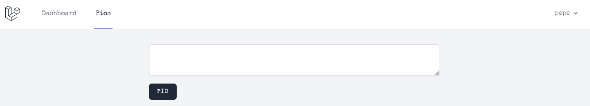

# Projecte bàsic en Laravel (v.^9.0)

## Instal·lació de projecte


```shell
composer create-project laravel/laravel piopio
cd piopio
php artisan serve
```


## Sistema d'autenticació, laravel breeze

Aquest sistema proporciona login, registre, reset de password, verificació d'email i confirmació de password. Té disponibilitat de tres tipus de vistes, en Blade, Vue i React.


```shell
composer require laravel/breeze --dev
php artisan breeze:install blade
```


Com s'observa, el nostre sistem funciona amb Blade.

A continuació, per observar si ha funcionat, observem que s'han creat una sèrie de recursos a _resources/views._

Fem ara una instal·lació de paquets JS necessaris per la correcta configuració del sistema. Serà necessari tenir instal·lats el gestor de paquets de NodeJS npm.

```shell-session
npm install
npm run dev
```

La UI (interfaç d'usuari) ja ha estat creada, ara caldrà crear la infraestructura (base de dades), treballarem en sqlite per tant ho indiquen en la variable d'entor DB\_Connection:

```
# .env
DB_CONNECTION='sqlite'
```

Modifiquem el fitxer de configuració de base de dades per indicar la ruta del fitxer sqlite i que habilitem l'ús de FOREIGN\_KEYS. Tan mateix hem de crear manualment el fitxer `sqlite`.

```php
// config/database.php
....
 'connections' => [

        'sqlite' => [
            'driver' => 'sqlite',
            'url' => env('DATABASE_URL'),
            'database' => storage_path().'/piopio.sqlite',
            'prefix' => '',
            'foreign_key_constraints' => env('DB_FOREIGN_KEYS', true),
        ],
```

En storage/ creem el fitxer `piopio.sqlite`.

```shell
touch piopio.sqlite
```

Ara posem en marxa les migracions, per donar suport de dades a l'aplicació:

```bash
 php artisan migrate:fresh
 Dropping all tables .................................. 54ms DONE
 INFO  Preparing database.  
 Creating migration table ............................. 13ms DONE
   INFO  Running migrations.  
  2014_10_12_000000_create_users_table ................. 26ms DONE
  2014_10_12_100000_create_password_resets_table ....... 27ms DONE
  2019_08_19_000000_create_failed_jobs_table ........... 28ms DONE
  2019_12_14_000001_create_personal_access_tokens_table  32ms DONE
```

## Comencem a desenvolupar

La nostra aplicació tracta de crear "pios" una versió descafeïnada de twitter.

Els pios es desen en una taula, també es poden controlar (crear, mostrar, modificar i eliminar), per tal cosa necessitem un model Pio, una migració de model cap a la base de dades i un controlador de recursos (PioController).

El comando que mostrem a continuació pot fer aquestes tres coses, de fet si necessitem més ajuda dels comandos, li afegirem l'opció `--help`.

<pre class="language-php"><code class="lang-php"><strong>php artisan make:model --help
</strong><strong>// aquí l'ajuda
</strong></code></pre>

```php
php artisan make:model -mrc Pio
```

Aquesta instrucció crea:

* `app/Models/Pio.php` - El model en Eloquent
* `database/migrations/<timestamp>_create_pios_table.php` - La database migration que crea la taula a la base de dades.
* `app/Http/Controller/PioController.php` - The HTTP controller que processa les requests i retorna les respostes.

### Enrutament

Ara hem de crear les URLs a través de les quals ens comuniquem amb els controladors.

Editem el fitxer routes/web.php que conté les rutes definides en entorn web, utilitza les [_Facades_](https://laravel.com/docs/9.x/facades) de Route, mètode simplificat d'accés estàtic a l'enrutador:


```php
// routes/web.php
<?php
 
use App\Http\Controllers\PioController;
use Illuminate\Support\Facades\Route;
 ...
Route::get('/dashboard', function () {
    return view('dashboard');
})->middleware(['auth', 'verified'])->name('dashboard');
 
Route::resource('pios', PioController::class)
    ->only(['index', 'store'])
    ->middleware(['auth', 'verified']);
 
require __DIR__.'/auth.php';
```


Per accedir a l'escriptori (dashboard), és necessari passar el filtre 'auth' i 'verified', que indiquen que l'usuari a confirmat el seu email i s'ha autenticat.

Podem observar les rutes creades am el comando artisan:

```shell
php artisan route:list
```

<table><thead><tr><th width="96">Verb</th><th width="128">URI</th><th>Acció</th><th>Nom Ruta</th></tr></thead><tbody><tr><td>GET</td><td><code>/pios</code></td><td>index</td><td>pios.index</td></tr><tr><td>POST</td><td><code>/pios</code></td><td>store</td><td>pios.store</td></tr></tbody></table>

### Controlador

El controlador actua com un controlador de recursos i tot i que s'han creat molts mètodes dins la classe PioController, només donarem pas a '`store`' o desar els pios i a '`index`' que ens mostrarà tots els 'pios'.

```php
<?php
 ...
class PioController extends Controller
{
    /**
     * Display a listing of the resource.
     *
     * @return \Illuminate\Http\Response
     */
    public function index()
    {
        return view('pios.index');
    }
 ...
}
```

El mètode index permet la visualització a través de Blade, el nostre motor de plantilles per la vista, de tots els nostres _pios_.

### Blade

El motor de plantilles per a vistes és Blade, tot i que tenim llibertat a l'hora d'escollir la millor opció per al frontend.

En la versió 9, s'incorpora [tailwindcss](https://tailwindcss.com/) ( un framework CSS) i Alpine.js, framework JS.

L'anterior codi ens porta a retornar uns vista 'pios.index'. Ubicada a resources/views/pios, creem el fitxer (i el directori pios), index.blade.php.

&#x20;

<pre class="language-php"><code class="lang-php"><strong>//resources/views/pios/index.blade.php
</strong><strong>&#x3C;x-app-layout>
</strong>    &#x3C;div class="max-w-2xl mx-auto p-4 sm:p-6 lg:p-8">
        &#x3C;form method="POST" action="{{ route('pios.store') }}">
            @csrf
            &#x3C;textarea
                name="message"
                placeholder="{{ __('Què vols piolar?') }}"
                class="block w-full border-gray-300 focus:border-indigo-300 focus:ring focus:ring-indigo-200 focus:ring-opacity-50 rounded-md shadow-sm"
            >{{ old('message') }}&#x3C;/textarea>
            &#x3C;x-input-error :messages="$errors->get('message')" class="mt-2" />
            &#x3C;x-primary-button class="mt-4">{{ __('Pio') }}&#x3C;/x-primary-button>
        &#x3C;/form>
    &#x3C;/div>
&#x3C;/x-app-layout>
</code></pre>

Es basa en l'ús de components `<x-..>` definits en la carpeta components en `resources`. Observem que la resta és combinació html amb tailwindcss i llenguatge [blade](https://laravel.com/docs/9.x/blade).

Activem el frontend amb vite amb el comando&#x20;

```
npm run dev
```

&#x20;Aquest comando l'executem en terminal i crea un entorn frontend amb de manera que els canvis CSS i JS són immediats, no cal construir de nou.

<figure><figcaption><p>Formulari creació pio</p></figcaption></figure>

Anem a explicar a continuació el full de ruta del que ens queda per fer:


Quan donem al butó es desa el "pio" i torna a la mateixa vista però carregant els últims pios.


#### Afegir enllaç a menú de navegació

Fiquem un enllaç al menú de navegació del dashboard que ens mostri el llistat de pios.

```php
//resources/view/layouts/navigation.blade.php
  <!-- Navigation Links -->
                <div class="hidden space-x-8 sm:-my-px sm:ml-10 sm:flex">
                    <x-nav-link :href="route('dashboard')" :active="request()->routeIs('dashboard')">
                        {{ __('Dashboard') }}
                    </x-nav-link>
                    <x-nav-link :href="route('pios.index')" :active="request()->routeIs('pios.index')">
                        {{__('Pios')}}
                    </x-nav-link>
                </div>
```

#### Crear i guardar el pio

Es tracta de donar-li contingut al butó **PIO**.

Per fer-ho, anem al controlador PioController i editem  el mètode `store`.


```php
//app/Http/Controllers/PioController.php
/**
     * Store a newly created resource in storage.
     *
     * @param  \Illuminate\Http\Request  $request
     * @return \Illuminate\Http\Response
     */
    public function store(Request $request)
    {
        $validated=$request->validate([
            'message'=>'required|string|max:255',
        ]);

        $request->user()->pios()->create($validated);

        return redirect(route('pios.index'));
    }

```


Com es pot observar, es procedeix a validar la request del formulari (camp message a través del mètode POST), i si es compleixen els requeriments es passa a associar el pio creat a l'usuari que fa el request, tot aixó gràcies a les relacions, tal i com veurem.

Un cop creat, redirigiem de nou a la vista index dels pios.

#### Establir les relacions en Eloquent

Com ja hem comentat un comp obtenim l'usuari que està fent el pio, (`$request->user()`), obtenim un objecte `User` que es relaciona amb els pios de la següent manera, "un usuari pot fer molts pios". Aquesta relació és diu `hasMany()`.

```php
//app/Models/User.php
....
 /**
     * return all pios collection by user
     *
     * @return void
     */
    public function pios(){
        return $this->hasMany(Pio::class);
    }

//app/Models/Pio.php
...
/**
     * returns user owner
     *
     * @return User
     */
    function user(){
        return $this->belongsTo(User::class);
    }
```

Recordem afegir les dependències amb `use`....
