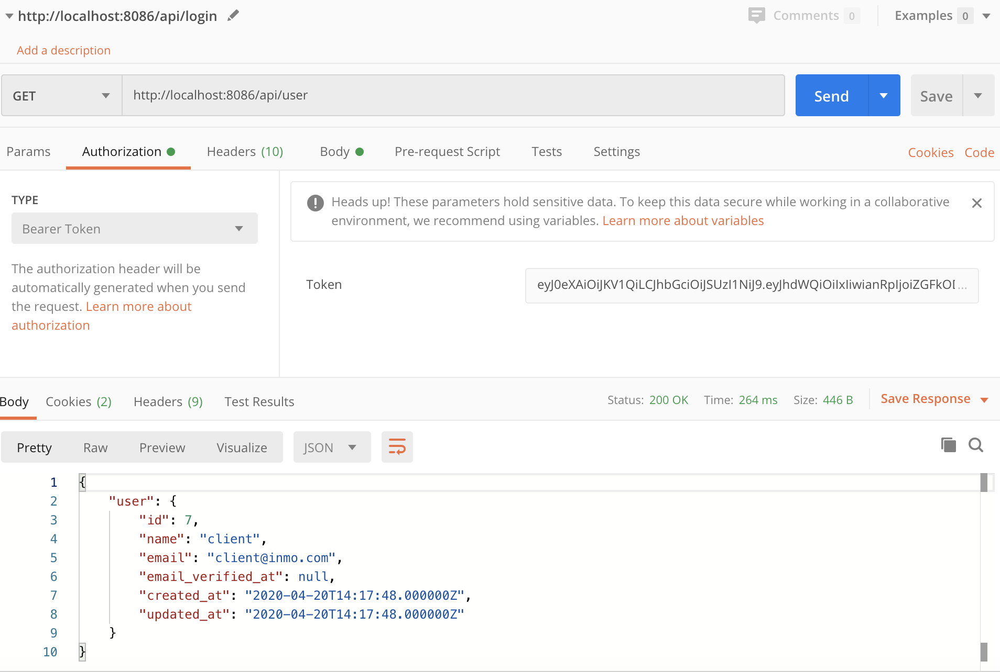

# API RestFUL en Laravel

Aquest apartat només mostrarà com crear un endpoint i una petita explicació de com fer-lo servir  amb alguns verbs **HTTP**.  
La part de crear un projecte **Laravel**, migracions i models ho veurem molt ràpidament, ja que se suposa que està vist en la UF3, i crearem només una taula, molt senzilla, per no complicar-nos , però que potser vegem en detall més endavant en un altre apartat.  
Si ja tens un projecte funcionant  en Laravel, ens podem   saltar la següent secció.

#### **Requisits:**

* PHP ≥7.2
* Composer: Per instal·lar Laravel.
* Una base de dades creada. En aquest apartat farem servir Mysql i la BD es dirà **PROVESAPI** .

El com manegen la  base de dades ho deixarem com a personal. La majoria de les operacions les farem amb Laravel.

#### **Instal·lant Composer:**

Tenim  [ el lloc oficial.](https://getcomposer.org/)

#### **Instal·lant Laravel:**

```text
composer global require "laravel/installer”
```

\(  triga una mica.\)

Un cop estigui a punt la instal·lació podem crear el nostre projecte en Laravel!

```text
laravel new miApiRest
```

Sense entrar en molt detall, el que fa la comanda és crear una carpeta **miApiRest** , instal·lar les dependències de Laravel dins d'aquesta carpeta, preparar l'arxiu **.env** \(que farem servir per connectar-nos a la nostra BD\), i generar la _**application key**_ per desenvolupar en la nostra màquina **.**

## **Connectant a la base de dades:**

Aquesta part és easy peasy. L'únic que hem de fer és modificar el fitxer **.env** que es troba a l'arrel del nostre projecte **miApiRest**.

L'omplirm amb les dades de la  BD \(que haurem creat, amb les dades definides\):

```text
[...] DB_CONNECTION = mysql 
DB_HOST = 127.0.0.1 
DB_PORT = 3306 
DB_DATABASE = PROVESAPI 
DB_USERNAME = user 
DB_PASSWORD = ********* [...]
```

**Migracions:**

Per no estendre'ns gaire, crearem una taula ultra senzilla anomenada **Pokémon** amb els camps **id** i **nom** .  
La gràcia de les migracions és que podem  tenir la base de dades dins del control de versions com _git_.

Amb el terminal que vulguis entrem  a la carpeta arrel del nostre projecte i executem la següent comanda:

```text
$ php artisan make: migració create_table_pokemons
 Migració creada: 2018_05_08_044418_create_table_pokemons
```

Revisem el que acaba de crear-se:  
La recentment creada migració hauria d'estar en **base de dades / migrations.**

Juntament amb **2020\_02\_08\_044418\_create\_table\_pokemons.php** , si estem en un projecte nou, haurien d'haver 2 migracions més. Aquestes les crea Laravel per defecte per mantenir usuaris. Les esborraré en aquest cas ja que no les farem servir, però depèn del que volguem fer.

Editem la nostra recent creada migració de la següent manera:

Com vaig dir més amunt, mantindrem la BD molt simple per enfocar-nos només en la creació de l'API.

Aquesta migració hauria de crear una taula **pokemons** amb les camps **id** , **name** , **created\_at** i **deleted\_at** . Els 2 últimes els fa anar Laravel de forma automàtica.

**Executem la nostra migració:**

```text
$ php artisan migrate
 Migració: 2018_05_08_044418_create_table_pokemons Migrat 
: 2018_05_08_044418_create_table_pokemons
```

Hauria d'estar la taula ja creada en la nostra BD. A l'revisar que tot va sortir bé, podem començar a crear el nostre model, per poder modificar aquesta taula.

**Model:**

```text
$ php artisan make:model Pokemon
 Model creat amb èxit.
```

El model acabat de crear hauria d'estar dins de la carpeta **App/Models.**

Ja que el camp **name** és l'únic que modificarem en aquest cas, el afegim a l'atribut **$fillable** de la classe Pokemons.

Nota: Per crear el model + la migració amb un sol comandament pots utilitzar:

> `php artisan make:model pokemon -mf`

Ara, estem preparats per crear el _controller_ que tindrà els mètodes a cridar per la nostra API.

**Creant el Resource controller:**

Un dels avantatges de Laravel, és que pot crear un controlador amb mètodes ja establerts per a una api, i tenir a punt tot per a l'ús dels verbs HTTP. Tot en un senzill pas:

```text
$ php artisan make: controller Api/PokemonController -r
```

El **-r** , vol dir que aquest controller es farà servir com a recurs, i laravel deixa els mètodes llestos per ser omplerts. Si no afegir -r, es crearà un controller totalment buit.

Vegem com ens va quedar:

Ara anem a crear la ruta per accedir al nostre recentment creat controlador.

En Laravel, només hem de definir el nom de l'endpoint, i el controlador.

Hem obrir el fitxer **routes/api.php** , el qual potser ja tingui un middleware configurat \(auth\) per users per defecte, però que ignorarem.

```php
<?php

use Illuminate\Http\Request;

/*
|--------------------------------------------------------------------------
| API Routes
|--------------------------------------------------------------------------
|
| Here is where you can register API routes for your application. These
| routes are loaded by the RouteServiceProvider within a group which
| is assigned the "api" middleware group. Enjoy building your API!
|
*/

Route::middleware('auth:api')->get('/user', function (Request $request) {
    return $request->user();
});


//Agreguem ruta al controlador de pokemons
Route::resource('pokemons', 'PokemonController');
```


Fem servir la comanda **`php artisan route:list`** , per veure si les nostres rutes quedar bé configurades:


Laravel, ha configurat   les rutes per als verbs **http** que vulguem fer servir, com [**GET, POST, PUT, PATCH i DELETE**](https://developer.mozilla.org/es/docs/Web/HTTP/Methods) . Si seguim l'estructura definida en aquesta llista, no ens podem perdre.

## **Proves ...**

Crearem uns pokemons amb unes peticions POST, i després demanarem un pokemon en específic usant GET. Això només perquè s'entengui la idea.

Primer, per guardar dades, si ens fixem en la llista de rutes, el verb **POST** està associat amb **api/pokemons** , i amb el mètode **pokemons.store.**

Segon, per mostrar les dades, el mètode **GET** està associat amb **api/pokemons/{pokemon}** , i amb el mètode **pokemons.show.**

Fem-li cas a la ruta.

En PokemonController, importaré l'arxiu **App\Pokémon** per poder canviar dades d'aquest, i omplirem els mètodes **store\(\)** i **show \(\)** .

```php
<?php

namespace App\Http\Controllers\Api;

use Illuminate\Http\Request;
use App\Pokemon;

class PokemonController extends Controller
{
    /**
     * Display a listing of the resource.
     *
     * @return \Illuminate\Http\Response
     */
    public function index()
    {
        //
    }

    /**
     * Show the form for creating a new resource.
     *
     * @return \Illuminate\Http\Response
     */
    public function create()
    {
        //
    }

    /**
     * Store a newly created resource in storage.
     *
     * @param  \Illuminate\Http\Request  $request
     * @return \Illuminate\Http\Response
     */
    public function store(Request $request)
    {
        //Instanciem la classe Pokemon
        $pokemon = new Pokemon;
        //Declarem el nom amb el request
        $pokemon->name = $request->name;
        //Desem els canvis
        $pokemon->save();

    }

    /**
     * Display the specified resource.
     *
     * @param  int  $id
     * @return \Illuminate\Http\Response
     */
    public function show($id)
    //public function show(Pokemon $pokemon)
    {
        //Demanem al model el Pokemon amb  id requerit pele mètode HTTP  GET.
        return Pokemon::where('id', $id)->get();
        // una altra opció si ens passen per paràmetre Pokemon
        // return $pokemon;
    }

    /**
     * Show the form for editing the specified resource.
     *
     * @param  int  $id
     * @return \Illuminate\Http\Response
     */
    public function edit($id)
    {
        //
    }

    /**
     * Update the specified resource in storage.
     *
     * @param  \Illuminate\Http\Request  $request
     * @param  int  $id
     * @return \Illuminate\Http\Response
     */
    public function update(Request $request, $id)
    {
        //
    }

    /**
     * Remove the specified resource from storage.
     *
     * @param  int  $id
     * @return \Illuminate\Http\Response
     */
    public function destroy($id)
    {
        //
    }
}
```

Iniciem el nostre server amb la comanda **php artisan serve.**

Ara podem utilitzar el nostre mètode preferit per provar APIs. En el meu cas faré servir [**Postman**](https://www.getpostman.com/)**.,** o el comando **curl -X:**

```php
curl -d "name=Lugia" -X POST http://localhost:8000/api/pokemons
```

o en format application/json

```php
curl  -d '{"name":"Lugia"}' -H "Content-Type: application/json" -X POST http://localhost:8000/api/pokemons

```

Provem el mètode **store**\(\) a POSTMAN


Sent una petició POST, vam enviar un JSON amb la informació que volem inserir en la nostra BD.

Vam provar enviant el meu primer Pokémon **Lugia.**  
La nostra API ens respon amb un **status: 200 OK** .

Revisem la nostra BD:Bé!

Ara provem el mètode **show** \(\):


Postman va sol·licitar amb un mètode GET  el Pokémon amb l'id = 1 a la nostra BD, en aquest cas sent Lugia.

## I l'autenticació?

El propi Laravel recomana l'ús de Laravel/passport que permet gestionar l'autenticació en accessos via API. 

[Laravel Passport](https://laravel.com/docs/7.x/passport)

**A mode de resum:**

### Instal·lació de passport

```php
composer require laravel/passport
```

### Afegint laravel/passport

Afegir nou servei al proveïdor de serveis, en **`config/app.php`**

```php
'providers' => [
    ....
    Laravel\Passport\PassportServiceProvider::class,
]
```

Ara cal afegir les taules per donar suport al sistema d'autenticació per passport:

```php
php artisan migrate
```

I instal·lació de passport:

```php
php artisan passport:install
```

### Service provider i configuració de Passport

En aquest punt, es tracta d'aplicar configuracions sonbre l'apliació, cal afegir en primer lloc el trait **Laravel\Passport\HasApiTokens** al model User.

```php
.....
use Laravel\Passport\HasApiTokens;

class User extends Authenticatable
{
    use Notifiable,HasApiTokens;
....
```

I en el proveïdor de serveis d'autenticació, **app/Providers/AuthServiceProvider.php**  on afegirem `Passport::routes` en el mètode boot\(\)

```php
public function boot()
    {
        $this->registerPolicies();
        Passport::routes();

        //
    }
```

En la configuració de mètodes d'autenticació en **config/auth.php** afegim**:**

```php
return [
    ....
 
    'guards' => [
        'web' => [
            'driver' => 'session',
            'provider' => 'users',
        ],
 
        'api' => [
            'driver' => 'passport',
            'provider' => 'users',
        ],
    ],
 
    ....
]
```

**driver de api ha de ser 'passport'**

\*\*\*\*

### Crear rutes

Les rutes cal definir-les en les rutes per a API: **`routes/api.php.`** La definició de rutes en aquest fitxer incorpora _de facto_ el prefixe **api/**


```php
use App\Http\Controllers\Api\UserController;

Route::middleware('auth:api')->group(function () {
    Route::get('user', [UserController::class,'details']);
    Route::resource('pokemons',PokemonController::class);
});

Route::post('login', [UserController::class,'login']);
Route::post('register',[UserController::class,'register']);

```

### Crear CRUD

Primer crearem un controlador per l'autenticació via Passport en API:

```php
 namespace App\Http\Controllers\Api;

    use Illuminate\Http\Request;
    use App\User;
    use Illuminate\Support\Facades\Auth;
    use Illuminate\Support\Facades\Hash;
    use Illuminate\Contracts\Validation\{Validator};

    class UserController
    {
    /**
    * User Register
    */
    public function register(Request $request)
    {
        $dataValidated=$request->validate([
            'name' => 'required|min:3',
            'email' => 'required|email|unique:users',
            'password' => 'required|min:6',
        ]);
        $dataValidated['password']=Hash::make($request->password);

        $user = User::create($dataValidated);

        $token = $user->createToken('AppNAME')->accessToken;

        return response()->json(['token' => $token], 200);
    }
    /**
         * User Login
         */
        public function login(Request $request)
        {
            $credentials = [
                'email' => $request->email,
                'password' => $request->password
            ];

            if (auth()->attempt($credentials)) {
                $token = auth()->user()->createToken('AppNAME')->accessToken;
                return response()->json(['token' => $token], 200);
            } else
                return response()->json(['error' => 'UnAuthorised'], 401);
        }
        /**
         * Returns Authenticated User Details
         *
         * @return \Illuminate\Http\JsonResponse
         */
        public function details()
        {
            return response()->json(['user' => auth()->user()], 200);
        }
    }

```

La idea és que si tot va bé ens genera un token  `->createToken('AppNAME'`que actua com a testimoni de seguretat i que cal incorporar.lo en qualsevol petició.

Per tant si volguèssim , per exemple, veure els detalls de l'usuari, necessitem el token. En cas d'utilitzar l'eina Postman, seleccionarem **Authorization: Bearer Token**



Caldrà ara fer servir el PropertyController per poder desenvolupar de forma correcta la nostra API.

Només un apunt: us adjunto com seria mostrar una propietat:

```php
public function show($id)
    {
        $$property = auth()->user()->properties()->find($id);
 
        if (!$property) {
            return response()->json([
                'success' => false,
                'message' => 'Property with id ' . $id . ' not found'
            ], 400);
        }
 
        return response()->json([
            'success' => true,
            'data' => $property->toArray()
        ], 400);
    }
```

### Testejar

Uilitzeu POSTMAN per poder comprovar el correcte funcionament.


