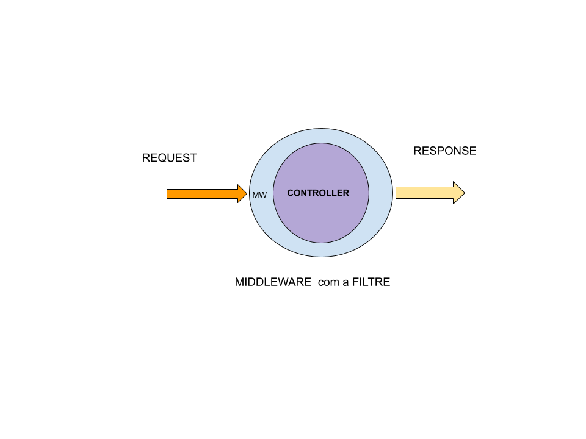

# Aplicació en Laravel

A continuació us indiquem quins passos cal seguir per realitzar una aplicació en Laravel:

## 1.Casos d´ús

Ens permet entendre les diferents accions del nostre projecte

| EXEMPLE |  |
| :--- | :--- |
| USUARI \(ROLE\) | Login |
|  | Registre |
|  | Propietat /Registrar |
|  | Propietat /Editar |
|  | Propietat / Eliminar |
|  | Publicació / Crear |
|  | Publicació / Editar |
|  | Publicació / Eliminar |
| ADMIN \(ROLE\) | Backend Users |
|  | Backend Properties |
|  | Backend Publications |

## 2.Crear i modificar l'entorn .env de l'app

Modificar dades d'accés a la base de dades i usuari d'accés a la base de dades.

```text
DB_CONNECTION=mysql
DB_HOST=127.0.0.1
DB_PORT=3306
DB_DATABASE=inmo
DB_USERNAME=inmo
DB_PASSWORD=linuxlinux
```

## 3. Activar l'autenticació i sistema ui

Si utilitzem sistema d'autenticació, caldria configurar-lo:

```text
$ composer require laravel/ui
```

I activat amb el frontend que desitgem:

```text
$ php artisan ui bootstrap --auth
```

Si volguèssim definir-lo més tard, simplement acondicionem l'autenticació, controladors, proveïdors i vistes:

```text
$ pho artisan make:auth
```

## 4. Definir models i relacions associades i fer les migracions

Podem fer servir els comandos artisan per crear els models. Un cop creats, cal acabar-los d'implementar.


```text
php artisan make:model Property -m
```

Després de definir els models i les seves migracions \(-m\), podem continuar modificant les migracions.

```text
php artisan make:migrations create_table_properties
```

Si migreu \( `php artisan migrate` \), ja tindreu creades les taules a la vostra base de dades.

Ara caldrà comprovar com queda l'script de migració:

Crearem un altre script de migració:

```text
php artisan make:migrations change_table_properties
```

 El modifiquem afegint les funcions **up**\(\) i **down**\(\) \(crear i eliminar taula\). Aneu amb compte amb els tipus de dades relacionats **id** de _users_ i **users\_id** de _properties_

```php
class ChangeTableProperties extends Migration
{
    /**
     * Run the migrations.
     *
     * @return void
     */
    public function up()
    {
        Schema::create('properties', function (Blueprint $table) {
            $table->bigIncrements('id');
            $table->decimal('price',8,2);
            $table->string('description');
            $table->bigInteger('user_id')->unsigned();
            $table->timestamps();
            $table->foreign('user_id')->references('id')->on('users');
        });
    }

    /**
     * Reverse the migrations.
     *
     * @return void
     */
    public function down()
    {
        Schema::dropIfExists('properties');
    }
}

```

Ara ja podríem executar la migració: `php artisan migrate`

Acabem de fer la resta de models i les relacions pertinents.

## 5. Crear els "_middlewares_" que en siguin necessaris

Podem crear un middleware de _control del rol_ d'usuari, recordem que un middleware actua com un filtre. 



Modificarem el model User, afegirem el camp de 'roles', i l'actualitzarem, Després afegirem els mètodes per manipular els rols al mateix model.

Pas a pas, caldrà crear una migració per afegir el camp roles al model - taula User, in cop migrat, afegim els mètodes al model:

```php
class User extends Authenticatable
{
    use Notifiable;

    /**
     * The attributes that are mass assignable.
     *
     * @var array
     */
    protected $fillable = [
        'name', 'email', 'password',
    ];

    /**
     * The attributes that should be hidden for arrays.
     *
     * @var array
     */
    protected $hidden = [
        'password', 'remember_token',
    ];

    /**
     * The attributes that should be cast to native types.
     *
     * @var array
     */
    protected $casts = [
        'email_verified_at' => 'datetime',
        'roles' => 'array'
    ];

    /***
     * @param string $role
     * @return $this
     */
    public function addRole(string $role)
    {
        $roles = $this->getRoles();
        $roles[] = $role;

        $roles = array_unique($roles);
        $this->setRoles($roles);

        return $this;
    }

    /**
     * @param array $roles
     * @return $this
     */
    public function setRoles(array $roles)
    {
        $this->setAttribute('roles', $roles);
        return $this;
    }

    /***
     * @param $role
     * @return mixed
     */
    public function hasRole($role)
    {
        return in_array($role, $this->getRoles());
    }

    /***
     * @param $roles
     * @return mixed
     */
    public function hasRoles($roles)
    {
        $currentRoles = $this->getRoles();
        foreach($roles as $role) {
            if ( ! in_array($role, $currentRoles )) {
                return false;
            }
        }
        return true;
    }

    /**
     * @return array
     */
    public function getRoles()
    {
        $roles = $this->getAttribute('roles');

        if (is_null($roles)) {
            $roles = [];
        }

        return $roles;
    }
    .......
```


També ens crearem unes classes de suport **UserRole** i **RoleChecker,** ja que si volem rols amb jerarquia \(de més a menys seria ROLE\_ADMIN i ROLE\_USER a l'estil Symfony\). 

```php
namespace App\Role;


class UserRole
{
    const ROLE_ADMIN = 'ROLE_ADMIN';
    const ROLE_ACCOUNT_MANAGER = 'ROLE_ACCOUNT_MANAGER';
    const ROLE_USER = 'ROLE_USER';

    /**
     * @var array
     */
    protected static $roleHierarchy = [
        self::ROLE_ADMIN => ['*'],
        self::ROLE_ACCOUNT_MANAGER => [
            self::ROLE_USER
        ],
        self::ROLE_USER => []
    ];

    /**
     * @param string $role
     * @return array
     */
    public static function getAllowedRoles(string $role)
    {
        if (isset(self::$roleHierarchy[$role])) {
            return self::$roleHierarchy[$role];
        }

        return [];
    }

    /***
     * @return array
     */
    public static function getRoleList()
    {
        return [
            static::ROLE_ADMIN =>'Admin',
            static::ROLE_ACCOUNT_MANAGER => 'Account Manager',
            static::ROLE_USER => 'User',
        ];
    }
}

```

```php
namespace App\Role;

use App\User;

class RoleChecker
{

    /**
     * @param User $user
     * @param string $role
     * @return bool
     */
    public function check(User $user, string $role)
    {
        // Admin has everything roles
        if ($user->hasRole(UserRole::ROLE_ADMIN)) {
            return true;
        }
        else if($user->hasRole(UserRole::ROLE_ACCOUNT_MANAGER)) {
            $managementUserRoles = UserRole::getAllowedRoles(UserRole::ROLE_ACCONUNT_MANAGER);

            if (in_array($role, $managementUserRoles)) {
                return true;
            }
        }

        return $user->hasRole($role);
    }
}

```

A continuació crearem un middleware per al xequeig del rol que podem utilitzar de forma global o en una ruta o grup de rutes.

```bash
php artisan make:middleware CheckUserRole  
```

```php
namespace App\Http\Middleware;

use Closure;

class CheckUserRole
{
    /**
     * @var RoleChecker
     */
    protected $roleChecker;

    public function __construct(RoleChecker $roleChecker)
    {
        $this->roleChecker = $roleChecker;
    }

    /**
     * Handle an incoming request.
     *
     * @param \Illuminate\Http\Request $request
     * @param \Closure $next
     * @param string $role
     * @return mixed
     * @throws AuthorizationException
     */
    public function handle($request, Closure $next,$role)
    {
        /** @var User $user */
        $user = Auth::guard()->user();

        if ( ! $this->roleChecker->check($user, $role)) {
            throw new AuthorizationException('You do not have permission to view this page');
        }

        return $next($request);

    }
}

```

Després cal enregistrar el Middleware i ja podem utilitzar-lo. En la classe `App\HTTP\Kernel` : Definim una ruta \(linia 8\)

```text
.....
protected $routeMiddleware = [
        'auth' => \App\Http\Middleware\Authenticate::class,
        'auth.basic' => \Illuminate\Auth\Middleware\AuthenticateWithBasicAuth::class,
        'bindings' => \Illuminate\Routing\Middleware\SubstituteBindings::class,
        'cache.headers' => \Illuminate\Http\Middleware\SetCacheHeaders::class,
        'can' => \Illuminate\Auth\Middleware\Authorize::class,
        'check.user.role' => \App\Http\Middleware\CheckUserRole::class,
        'guest' => \App\Http\Middleware\RedirectIfAuthenticated::class,
        'password.confirm' => \Illuminate\Auth\Middleware\RequirePassword::class,
        'signed' => \Illuminate\Routing\Middleware\ValidateSignature::class,
        'throttle' => \Illuminate\Routing\Middleware\ThrottleRequests::class,
        'verified' => \Illuminate\Auth\Middleware\EnsureEmailIsVerified::class,
    ];
```

Per utilitzar el middleware en ruta:

```text
Route::put('post/{id}', function ($id) {
    //
})->middleware('check.user.role:' 
. \App\Role\UserRole::ROLE_ADMIN);
```


## 6. Crear els controladors i les seves accions en funció de les rutes definides

## 7. Associar i crear les vistes a través de blade

## 8. Tests

## 

